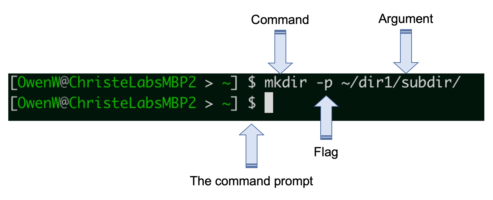

# Unix/Linux Shell basics

The Unix/Linux *'Shell'* describes a program that takes commands from an input (eg. your keyboard) and passes them to an operating system that will execute them. In contrast to a *Graphical User Interface (GUI)* the Shell is simultaneously a *command line interface (CLI)* and a programming language that allows you to perform tasks on your system.

<p align="center">
  
</p>

Interacting with a system through the Shell has many advantages over a GUI. The Shell allows you to quickly and easily navigate through directories on your computer, make, copy and search files in a systematic way, and construct pipelines that will execute complex tasks on big datasets.

Importantly, the Shell allows us to do each of these in the context of Bioinformatics, and Bioinformatics software.

## Why learn to use a Shell?  
------
GUIs enable you to interact with your files and software in very limited ways by clicking buttons or selecting check boxes that correspond to choices you can make about how the software can run. Due to the design of the GUI the options available for any peice of software are limited to the most popular options, but these options do not represent the full potential of the software used by the GUI wrapper. These options may not be optimal for the dataset that you are working with, and the software might not be the latest version. When this happens you will run into what we call "bugs" where the GUI crashes or times out before the data are processed. In this case you may be able to update your GUI, but often you're left looking desparately for another tool that will do something similar. 


<table>
<tr><th>Advantages of using the terminal </th></tr>
<tr><td><table></table>

|Considerations|GUI|Terminal| 
|--|--|--|
|Software options available| Limited options|All possible options|
|Software version|Static|Easy to update |
|Debugging|Difficult without input from the developer|Some Google-fu required from the user with information from error logs|

</td></tr> </table>

In the terminal environment it is easy to update the software package if it crashes or times out on while processing your data. You also have access to the full suite of possibiliites intended by the software developer by interacting with the software through the CLI. This enables more flexibility in your analysis and the ability to leverage options that are optimal for processing your dataset. Lastly when the software does crash there is generally an error message or a log file explaining what process caused the crash. Mitigating these issues requires a little "google-fu" on your part combing through stack exchange messages where previous users of the same software got the same error message and have implemented various fixes

## The Bash shell
-------
### The absolute basics

There are different types of Unix shells, however the most popular is Bash (the *Bourne Again Shell*), which is also the most common on Linux sysetms. Since the majority of participants will be using the Bash shell, and this is the default shell used on Dartmouth's high performance computing system (which we will be using), this lesson will introduce the Shell through using the Bash shell, however most, if not all, content should be transferable to other Unix shells.

> Use the Cheat Sheet in the GitHub repo to help you learn commands and available options.

Accessing the (bash) shell:  
- On a Mac or Linux system, the *Terminal* application provides access to the shell. There are also applications that you can download that provide customizations not present in the Terminal application, such as [iTerm2](https://iterm2.com/).
- On a Windows system, you can use an application such as [MobaXterm](https://mobaxterm.mobatek.net/) or [PuTTY](https://www.putty.org/).

<p align="center">
  
</p>

When you open your terminal application you will be presented with the command prompt `$` when you are able to input commands. If the terminal is busy and cannot currently accept new commands, you will not be presented with the prompt.

When the prompt is shown, you can enter commands by typing them in after the prompt. Commands are typically composed of three components:  
- the name of the command itself  
- any flags or options you wish to run the command with (not always required)
- a file or directory to act on (sometimes implicit)

In the above example, we are asking the Shell to pass the `mkdir` command to the operating system (for making directories) with the `-p` option (which lets us make parent and sub directories at the same time) and the argument detailing what directory we want the command to make.

Manual pages for specific commands can be accessed using the `man` command.
```bash
man mkdir
```

The shell provides us with commands that allow us to list files in our current working directory, as well as change the current working directory to another location. For example:
```bash
# 'ls' command lists files in our current working directory
ls

```

### Paths, where is your data stored

A path is the address that indicates where your data are stored. If I told you that my data was stored in a directory (folder) called `data` , you would understand that you should search for a folder on my computer called `data`. In some cases there may be multiple directories called data and we would need to distinguish which directory contains the data of interest. In the image below there is a directory (folder) called `data_analysis`, which contains two directories called `project-1` and `project-2`. Each project directory contains another directory called `data`.

<p align="center">
  
</p>

The path `data_analysis/project-1/data/` refers specifically to the `data` directory in `project-1`. Each directory and sub-directory in the path are separated by the forward slash `/` to indicate the path through the directories to the directory of interest. For most bioinformatic software you will need to submit the location of the files you would like to analyze using a path. 

The command `pwd` in BASH is used to print the path of the current directory, `pwd` stands for *print working directory*. Test out the **print working directory** `pwd` command below to see what is returned.

```bash

# print the current working directory
pwd
```

### Absolute vs. relative paths

The command `pwd` returns the **absolute path** to your current working directory, the list of all directories and subdirectories to the get from the current directory to the root or home directory. You can see that absolute paths can get long and unweildy, especially if you have very detailed or long directory names. 

One "shortcut" that makes navigating the command line a bit easier is using a **relative path**. A **relative path** uses the directory structure (which we can see in our absolute path returned by the command `pwd`) to move up or down through directories using shortcuts. One very common shortcut is `..` which translates to the directory one level "above" your current directory. 

Using the example in the figure again, from `data_analysis/project-1/data` we could get back to the `project-1` directory using the **absolute path** with the command `cd /data_analysis/project-1/` or we could use the **relative path** with the command `cd ..`.

This shortcut saves a lot of time and typing BUT it requires that you have a <u>good understanding</u> of where you are in your directory structure, so do not be shy about using the `pwd` command. 


```bash

# '..' tells the shell to move your current directory up one directory
cd ..

# check you directory again
pwd
```

Relative paths are contrasted to **absolute paths** which always starts with a '/' and will start at the root (highest level) of the directory tree, and work from wherever you are in the directory substructure. A key difference to remember is the **absolute path** will always point you to the same location, regardless of your current working directory. A **relative path** like `cd ../` will always point to the directory above your current working directory, but your new location will be <u>*relative*</u> to your current working directory. 

By default, your terminal application will start your current directory as your *home directory* (more on that later). No matter where you are, you can always get back to your home directory using the tilde `~` with the `cd` command.

```bash
cd ~
```

## Log on to discovery cluster
-------

Most NGS data analysis will require a lot of memory and computing power, more than most laptops can handle efficiently. For these analyses leverging a high performance compute (HPC) cluster is often necessary. A cluster is a collection of compute resources, called nodes, that are accessed remotely through your local machine. You can leverage these resources for both data storage and data processing. These compute resources work together as a single system.

The discovery cluster is a resource hosted by Dartmouth's Research Computing team. Let's log onto the discovery cluster now. We will use a secure shell command `ssh` to log onto the discovery cluster (if you are not on campus you will need to be on the VPN network to log on to the cluster).

```bash

# Establish the secure shell connection ****REPLACE netID WITH YOUR OWN ID****
ssh netID@discovery.dartmouth.edu

# Enter your password at the prompt (when you type no characters will show up to preserve privacy)
netID@discovery.dartmouth.edu's password:

# You're in!
(base) [netID@discovery7 ~]$

```

### Logging in to an compute node on Discovery ### 

When you log into Discovery using SSH, your session will begin on a computer known as the head node.  This is a computer that sits atop the computing cluster and manages the activities of the compute nodes. The head node should never be used for large-scale computational tasks, instead we will request a compute node to work on by running the `srun` command and specifying the required resources:

```bash
srun --nodes=1 --ntasks-per-node=1 --mem-per-cpu=4GB --cpus-per-task=1 --time=08:00:00 --partition=preempt1  --pty /bin/bash
```

When you are finished programming you can exit the compute node with the `exit` command. Don't run this command now as we are aren't finished programming for the day! 


## Customizing your environment
-----

The command line *environment* describes a collection of variables that have been defined for you to provide context for the commands that you run. These are referred to as *environment variables*. The `env` command will show all environment variables available in the current shell. Try that now:

```bash
env
```

One important environment variable is `$HOME`, which contains the path to your home directory. You can print the defininition of a variable with the `echo` command, the preceeding `$` indicates you're referencing a variable. For example:

```bash
echo $HOME
```

You can define your own environmental variables during a remote session. These can be virtually anything. For example, perhaps you want to save the name of the genome version you are working with in your current session, so it can be easily called multiple times in some bash code you are writing.

```bash
# set the variable
GENOME="hg38.patch13"

# call it with echo and the $
echo $GENOME
```
  > You will notice I'm using all caps for my variables, this isn't required but it is good practice to indicate to yourself that you're using a variable
 
You can also use variables to store commands to save yourself from having to type the entire command out each time. For example, we might run the command `ls -lah` command often (show files in a list format, including all hidden files, and with file sizes in human readable format). 

```bash
# save to variable
LIST="ls -lah"

# call variable to execute command
$LIST
```

Variables created during a remote session will not persist between sessions, unless the variable is saved an *environment file*. These are a set of files that are executed everytime you start a new bash session. These files are typically hidden, so we need to use `ls` with the `-a` flag to see them. The `.bash_profile` is an example of an environment file, we can view the contents of this file with the `cat` command.

```bash
# navigate to your home directory
cd ~

# view files in current working directory and include hidden files
ls -a

# view contents of bash profile
cat .bash_profile
```

The `.bash_profile` is run every time you start a bash session and contains variables used to configure the bash environment. Defining a variable in the `.bash_profile` will enable the variable to persist between remote sessions. Lets define the variable `$LIST` in our `.bash_profile`.
```bash
# use the nano text editor to add the line ' LIST="ls -lah" ' to your bash_profile
nano `.bash_profile`

# source the new bash_profile to add the environment variables to your current session (or start a new bash session)
source ~/.bash_profile

# now run the command as we did above
$LIST
```

Now `$LIST` will be set as an environment variable every time we start a new bash terminal. 


### The remote terminal interface
------

The commands that we practiced above (`ls`, `pwd`, `cd`) on your local machine work the same way on the discovery cluster. Let's run our first command on the cluster to check the path of your working directory (remember this is your *home directory*).

```bash

# Check your location on the cluster
pwd

```

You should see something like `/dartfs-hpc/rc/home/h/netID` displayed in response to your command. Initially when you log on you will always be directed to your home directory (the address or path listed above). Your home directory by default will have 50GB of storage space to begin with, if you are running something that requires more storage space it is possible to extend that limit temporarily with the `/dartfs-hpc/scratch/` drive. This is where we have stored all of the files you will be working with today. Directories and files hosted on the `/dartfs-hpc/scratch/` drive will only be kept for 45 days, you will receive a notification from Research Computing before the data is deleted.

It is a good idea to stay organized when working on the terminal by creating project directories, so let's start by making a directory for this workshop called `fundamentals_of_bioinformatics`. 

You will notice that I chose a directory name with no spaces. The space is a special character, special characters need to be *escaped* with the `\` and so `funadmentals_of_bioinformatics` would look like `fundamentals\ of\ bioinformatics` with the escape characters. You can see that file names with spaces become unwieldy to type out so most programmers will replace spaces with `_`, `.`, or `-` in their filenames to keep everything neat.

```bash
# Navigate to scratch so you can make your own directory there 
cd /dartfs-hpc/scratch/

# Make the directory.  ****REPLACE 'sms' WITH YOUR OWN INITIALS******
mkdir -p sms/fundamentals_of_bioinformatics

# Change to the newly-created directory.
cd sms/fundamentals_of_bioinformatics

# Creat a variable so we can get here quickly 
FOB="/dartfs-hpc/scratch/sms/fundamentals_of_bioinformatics"

###############
# Add variable definition to .bash_profile
nano ~.bash_profile
# copy and paste the definition above with YOUR INITIALS
###############

# Check your location on the cluster
pwd

# List the contents of your directory
ls
```
As expected, the new directory that you created is empty. Lets copy a file from the `/dartfs-hpc/scratch/` directory we created for this workshop to the directory you just created. This file (`all_counts.txt`) provides raw read counts for an RNA-seq experiment, with genes in rows and samples in columns.

```bash

# Copy the file from the scratch drive to the fundamentals_of_bioinformatics directory you just created
cp /dartfs-hpc/scratch/FOB/all_counts.txt $FOB

```

### Viewing the contents of files

The shell provides us with commands to view the contents of files in define ways. The `cat` command for example (which stands for for concatenate) will print the entire contents of a file to the terminal. This can be useful for smaller files, but as you will see with larger files can quickly fill the terminal with more lines of data than it can display.

```bash
cat all_counts.txt
```

When working with larger files, which is common in bioinformatics, you may not wish to look at a portion of a file. Other commands exist that allow you to explore file contents with more control.
- `more` shows you as much of the file as can be shown in the size of the terminal screen you have open, and you can continue to "scroll" through the rest of the file by using the space bar  
- `less` is a similar command to `more`, and has advantages such as not persiting in the terminal, and being searchable
- `head` will print the first 10 lines by default, but this number can be controlled with the `-n` option
- `tail` will print the final 10 lines of a file, and can also be controlled with the `-n` option

We will use a larger text file to show the utility of these commands, as well as other commands in the subsequent parts of this lesson.
```bash
# Show the first 20 lines of the all_counts.txt file
head -n 20 all_counts.txt

# Show the last 50 lines of the all_counts.txt file
tail -n 50 all_counts.txt

# Use the word count (wc) command with the lines option (-l) to show how many lines (rows) are in the dataset
wc -l all_counts.txt
```

### Renaming and removing files

Sometimes you will need to reorganize your directories or rename a file, which can be achieved with the `mv` command. Let's start by copying the all_counts.txt file from the fundamentals_of_bioinformatics directory to your home directory.

```bash
# Copy the all_counts.txt file to your home directory
cp all_counts.txt ~/all_counts.txt
```
Now let's rename the copy of the all_counts.txt file that we just created.
```bash
# Rename the copied all_counts.txt file
mv ~/all_counts.txt ~/all_counts.copy.txt
```
You can also use the `mv` command to move a file to a new location. Let's move the all_counts.copy.txt from your home directory into your fundamentals_of_bioinformatics directory.
```bash
# Move the all_counts.copy.txt into your fundamentals_of_bioinformatics directory.  Replace scratch directory with your own.
mv ~/all_counts.copy.txt $FOB/all_counts.copy.txt

#check the contents of your fundamentals_of_bioinformatics directory
ls
```

Copying the all_counts.copy.txt file was just an exercise to show you how the tools work, in practice you will want to keep your directories as neat as possible as you accumulate a lot of files. Let's remove the all_counts.copy.txt file with the `rm` command.

```bash
# For the sake of being careful, let's first list the details file to be removed
ls -l all_counts.copy.txt
# Remove the all_counts.copy.txt file
rm all_counts.copy.txt
```

You will notice that before the file was deleted you were asked if you were sure you wanted this file deleted. You want to be careful not to remove files that you did not create if you are working in shared directories. If you want to bypass this checkpoint, you can use the `-f` flag with `rm -f` to force the removal of a file, but be careful with this, as there is no *Trash* equivalent in the shell.

### Manipulating file contents

Some commands enable you to manipulate and subset files based on specific parameters. One useful example is the `cut` command, which allows you to 'cut' a file based on the options you select, such as the `-f` option, which corresponds to tab delimited fields. We could use `cut` to obtain read counts for only the first 5 samples in `all_counts.txt`.
```bash
# Look at only the counts from the first five columns
cut -f 1,2,3,4,5 all_counts.txt
```

To prevent all rows being printed to our console, we could combine the `cut` command with the `head` command using a *'pipe'*, specified by a '|'. Pipes send the output of the initial command (on the left) to the next command (on the right), with a single line of code.
```bash
# List only the first 20 lines of only samples SRR1039508 (col 2) and SRR1039523 (col 17)
cut -f 1,2,17 all_counts.txt | head -n 20
```

Similarly to how we used the pipe operator (|) above, we could use the redirect operator(>) to send the output of the cut command to create a new counts file, that only contains the columns 1 (gene IDs), and samples in columns 2 and 17.
```bash
# Print the counts from SRR1039508 and SRR1039523 to a new file
cut -f 1,2,17 all_counts.txt > all_counts_sub.txt

# look at head of this new file
head all_counts_sub.txt
```

### Pattern matching with *grep*

Often we will want to pull a specific piece of information from a large file, let's say that we were interested in the read counts for a specific gene, ALDH3B1 (Ensembl ID: ENSG00000006534). We can use the `grep` command to search for this ID, or any other character string we are interested in, in our counts matrix.
```bash
# Get the count data for ENSG00000006534 (ALDH3B1) from all_counts.txt
grep "ENSG00000006534" all_counts.txt
```

`grep` is a pattern recognition tool that searches in files for a character string we can define. We can define the entire character string, as we did above, or combine regular characters with special characters (or 'wildcards') to search for specific types of matches. Some commonly used special characters are included in the table below.

Operator | Effect
---|---
\* | wildcard stands for any number of anything
^ | start of the line
$ | end of the line
[0-9] or \d| any number (0123456789)
[a-z]| any lowercase letter
[A-Z]| any uppercase letter
\t | a tab
\s | a space

These regular expressions can be used with any of the tools that you have learned thus far, so if we wanted to list all of the files in our directory that end in .txt we could use the following command.

```bash
# List all files that end in .txt
ls *.txt
```

We can even enhance the power of these regular expressions by specifying how many times we expect to see the regular expression with quantifiers.

Quantifier| Operation
---|---
X* | 0 or more repetitions of X
X+ | 1 or more repetitions of X
X? | 0 or 1 instances of X

Now let's use some of these regular expressions in a `grep` command  to see their utility. Let's use regular expressions to see how many genes have zero reads counted for the first four samples. The flag `-P` indicates that we will be using perl-style regular expressions in the pattern we are searching for, you can use `grep --h` to learn more about available flags for the `grep` command. 

```bash
# Count the number of genes with no reads in the first four samples
grep -P "^ENSG[0-9]*\t0\t0\t0\t0\t" all_counts.txt| wc -l

# Count the number of genes with no reads expressed in any of the samples
grep -P "^ENSG[0-9]*\t0\t0\t0\t0\t0\t0\t0\t0\t0\t0\t0\t0\t0\t0\t0\t0$" all_counts.txt| wc -l
```
-----

### Breakout room activities

- Open the cheat sheet link, try out commands you haven't seen before
- Set some new variables and save them in your .bash_profile (make sure you're not over writing other environmental variables)
- PRACTICE the bash commands - getting muscle memory for these commands and how to combine them and how they work are going free up your brain power to think about the analysis you want to perform rather than the commands you need to use. 


