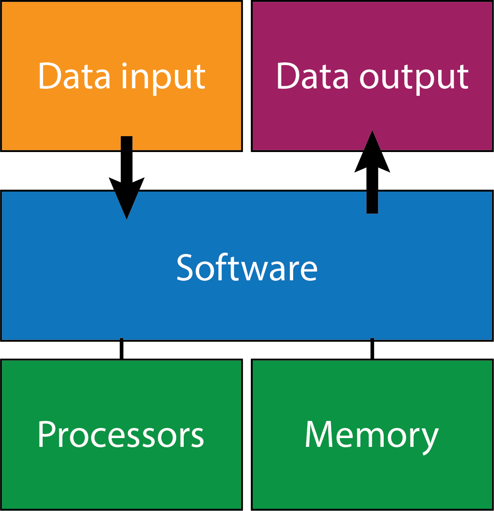
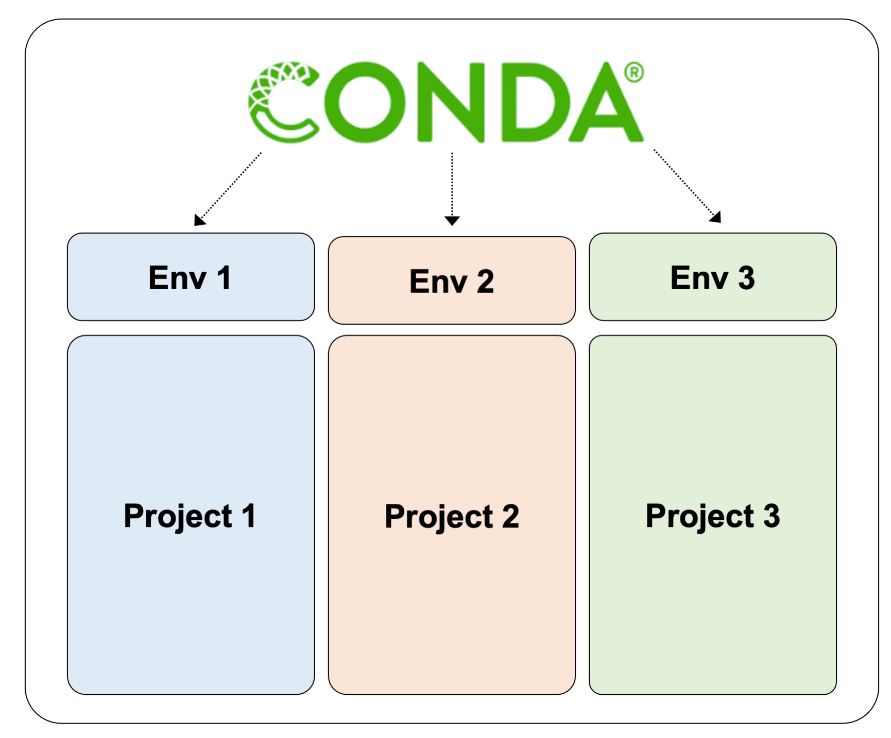
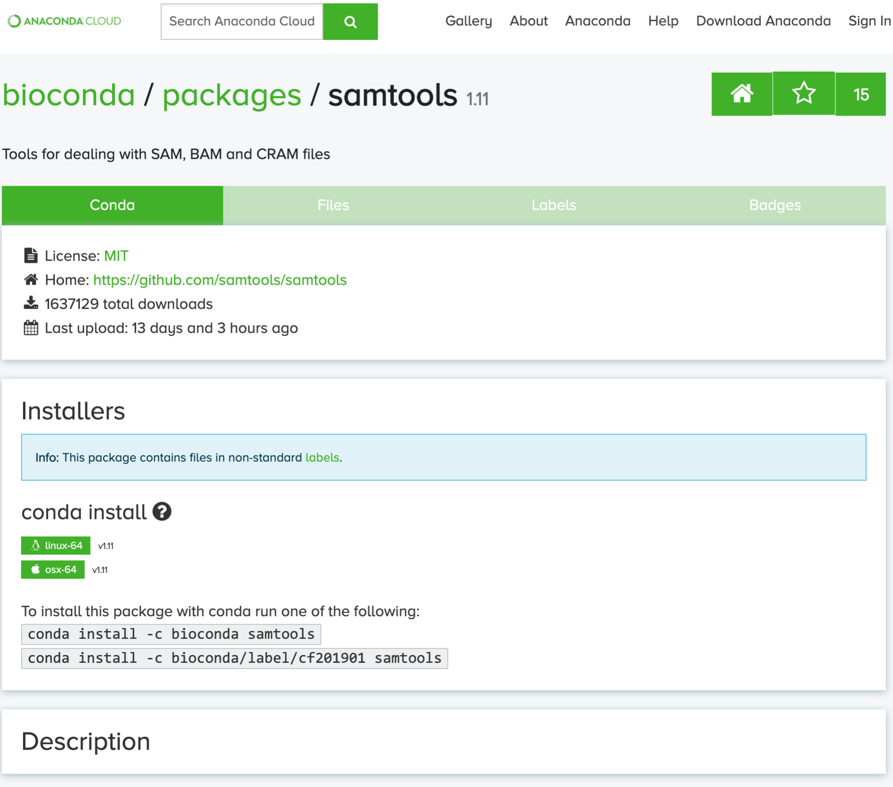

# Installing and managing bioinformatics software using a CLI

## Introduction

Bioinformatics software can be installed and managed in a number of ways. It is important to be keep track of software versions so that you can report what was used for specific analyses/projects such that those analyses can be repeated by another user.

Depending on the software to be installed, it may be available in one of the following formats:  
 - Pre-installed on your system (eg. linux core utilities)
 - Full package and environment management tools (eg. Conda)
 - Pre-compiled binary executable
 - Source code to be compiled
 - Virtual machine images (eg. Docker, Singularity)
 - Language-specific package managers (eg. R/Bioconductor, Python/pip)

<p align="center">
  
</p>

In this lesson, we will introduce the major ways bioinformatics packages can be installed and managed through a command line interface.


## What is software 
----
Before we discuss how to access software, it is important to understand the basics of compute resources. This may seem pedantic to some of you, but we want to make sure everyone is starting with the same background. The hardware of a system is the available memory and processing power of a compute resource. Software are a set of instructions, writing in a coding language, for manipulating data using the available hardware. Software can further be categorized into system software, which interfaces directly with the hardware of the compute system, an example of this would be your operating system and application software, which interfaces with the system software to leverage the hardware compute resources. All of the commands and software we will discuss in this workshop fall into the application category.

<p align="center">
  
</p>

As seen in the previous lesson, Linux systems will have many core utilities (software) for navigating the file system, creating, editing and removing files, and many more. In addition to these core utilities, there are many environmental variables already defined for you, one of these variables is `$PATH` which is defined by a list of absolute paths where software pre-installed on the system exists. Let's take a look at the variable `$PATH`

```bash

# look at the definition of $PATH with echo
# Use the path so the output from the first command is the input of the second command
# Use the 'tr' command to transform colons (:) to new lines (\n) so that each path is on a new line
echo $PATH | tr ":" "\n"
```

You will notice many of the directory names end in `bin` which standards for *binary*, a common directory name to store executables (programs, software, commands, etc.).  

Your `$PATH` definition may look different from the instructors, as we have added paths to our `$PATH` variable as we've either created or installed programs. These programs are now available to us as executables as the `$PATH` variable is set by the `.bash_profile` at the start of each new session.

Below is a toy example of how you would add a new executables directory to your `$PATH` variable:

```bash
export PATH="~/location/of/new/executables:$PATH"
```

In the command above we are re-defining the `$PATH` variable by adding a new path `~/location/of/new/executables` to the front of the existing definition of `$PATH` and separating the new path from the previous definition by a colon `:`. 

Many of the commands we worked with in the previous lesson can be found in `/usr/bin`. A command for finding where a program lives in the $PATH is the `which` command. This can be useful for debugging environment issues as they arise when trying to use or install new software. Check where the executable for the `echo` command is located.  The `which` command :

```bash
which echo
```

### What does it mean for software to be installed?

To run software on a Linux command line, the software must both exist, and be accessible by a relative or absolute path. When you do not provide a path to the software it is assumed that the software can be found in one of the locations defined in the `$PATH` variable. Lets demonstrate what happens when we remove these paths from the `$PATH` variable.


```shell
# Check which directory we're in
pwd

#See where pwd software is installed
which pwd

#Save your path to retreive later
PATH_BACKUP=$PATH

#Empty your PATH variable
PATH=
echo $PATH

#Try these commands
pwd
ls
cat all_counts.txt
#Note that the software is no longer accessible "pwd: No such file"

#It's possible to call them directly, as they all exist
/usr/bin/pwd
/usr/bin/ls
/usr/bin/cat all_counts.txt

#Re-establish your PATH variable
PATH=$PATH_BACKUP
echo $PATH
pwd
```


## Accessing software from executable files
-------

When we defined software earlier we discussed two major types of software, applications and system software. When most software is written it has been written with a specific systems software in mind (usually C or C++ for bioinformatics software), this is generally referred to as the source code. In order to ensure that a piece of software is accessible to many different users and systems programmers will sometimes *compile* the source code. **Compiling** source code involves translating the source coding language to a target coding language that can be leveraged by all (most) system software. Once the source code has been compiled it is considered **executable**.  

Some developers will pre-compile releases of their software for several operating systems and make them available for download. If a pre-compiled executable is available for the Linux system we are using (for Discovery, our OS is CentOS 7), this can be a painless way to install software. It only requires downloading the executable file to a directory and running it.  For example, the following code uses the `wget` command to download a binary, precompiled for Linux, of the bowtie2 aligner.

```bash
# download the executable file
wget https://github.com/BenLangmead/bowtie2/releases/download/v2.4.2/bowtie2-2.4.2-linux-x86_64.zip

# unzip the executable file
unzip bowtie2-2.4.2-linux-x86_64.zip

# move into the directory with the executable
cd bowtie2-2.4.2-linux-x86_64/

# look at the contents of the directory
ls

# run the executable to look at the help menu
./bowtie2 --help
```

Programs written in Java are frequently distributed as JAR files, which are similar to pre-compiled binaries in that only a single file is required to download and install the software. The JAR file is then run using the `java -jar` command.  For example, the following will download the "picard" set of genomics tools written in Java, and run it to output the help menu.

```bash
#download the jar file
wget https://github.com/broadinstitute/picard/releases/download/2.23.9/picard.jar

# run the executable with the java software to see the help menu
/opt/java/jdk1.8.0_66/bin/java -jar picard.jar -h
```


### Source code to be compiled

Not all software is available via a pre-compiled executable, these files must be compiled from source code.  As mentioned previously, for Bioinformatics software this will usually be C or C++ code, and source code will be distributed with a "makefile", which can be compiled by the user with the following commands.  

The `--prefix="/path/to/install"` defines the directory where the software will be installed. It is a good idea to use a path that exists in your `$PATH` variable, or at least to add the new path to your `$PATH` variable with the commands we learned above.

```bash
./configure --prefix="/path/to/install"
make
make install
```

With package managers becoming more widespread, you should only rarely need to install software by compiling source code. 


## Conda - Full package and environment management
----

[Conda](https://docs.conda.io/projects/conda/en/latest/) is an open source package and environment manager that runs on Windows, MacOS and Linux. Conda allows you to install and update software packages as well as organize them efficiently into *environments* that you can switch between to manage software collections and versions. 

Notice that in this section we have moved from discussing software to software packages. Often you will find that a program is written to leverage many other pieces of software, called dependencies. So one piece of software may combine data manipulation techniques from 5 other pieces of software to generate a unique output, these are the dependencies of the first piece of software. It is often the case that each of the 5 dependencies have their own dependencies, so that even though you're interfacing with the command structure for a single piece of software you're actually leveraging instructions for data manipulation from many pieces of software. To add even more complexity there are often multiple versions of software and dependencies each need to be a specfic version to function as part of the software you're interested in using. This is where software package managers like Conda really shine. 


Conda allows you to create a virtually unlimited number of software environments that can be used for specific analyses, and therefore presents efficient and reproducible way to manage your software across multiple projects. 



Environments can be created with or without specific versions of software. For example, to create a new environment called `env1` that uses python 3.7.1:
```bash
conda create -n env1 python=3.7.1
```

After creating a conda environment, you will need to activate it.
```bash
conda activate env1
```

After activating it, you will see the name of the environment appear in parentheses to the left of your command prompt. You can see all of the installed software in your environment using the `list` command.
```bash
conda list
```

Once your conda environment is activated, you can install new software by running a single line of code. For example, if we wanted to install `samtools` to this environment, we would run:
```bash
# DO NOT RUN NOW, AS IT MAY TAKE A SHORT WHILE
conda install -c bioconda samtools=1.9
```

`bioconda` refers to the specific *'channel'* that samtools will be installed from. Conda, and its parent distribution *Anaconda*, are organized into channels that contain specific collections of software. `bioconda` contains a lot of bioinformatics software.

The easiest way to identify the install details for a specific package is to search for it on the conda website. The image below shows an example of the page for the bioconda distribution of samtools (available [here](https://anaconda.org/bioconda/samtools)).

<p align="center">
  
</p>

When you are finished with your environment, or if you wish to switch to a different environment, you can simply run `conda deactivate` and you will be returned to your original software environment.
```bash
conda deactivate
```

Conda is an excellent way to install and manage software for bioinformatics, since typical programs used in bioinformatics require a large number of dependency packages, and we often want/need to use different versions for different projects.

> Research computing provides an introduction to using Conda on the Dartmouth computing infrastructure (link [here](https://services.dartmouth.edu/TDClient/1806/Portal/KB/ArticleDet?ID=72888)), which describes how to best make use of Conda on Discovery/Polaris/Andes.


We will do this now by loading a new environment with the tool `conda`. We have pre-built this `conda` environment for you such that all of the tools you will need have been loaded into this environment, you should have created this environment with the commands included in the welcome and setup email. Tomorrow we will talk more about how to create your own custom `conda` environment.

```bash
# Load conda environment
conda activate bioinfo
# Check your PATH compared to before activating, note the additional binaries folder
echo $PATH| tr ":" "\n"
```
This should change the word at the beginning of your prompt from `(base)` to the name of the conda environment that you just loaded `(bioinfo)`.


---

## Virtual machine images (eg. Docker, Singularity)

### How do VM images differ from conda environments

Virtual machine images allow software to be distributed along with an entire linux environment. This ensures that anyone running the software will be able to, regardless of software installed or environment variables, and make software management seamless.

However, containers can raise security issues when working with high performance computing clusters such as discovery. Docker cannot currently be used on discovery, and singularity images that can be currently used are somewhat limited.


---


## Language-specific package managers

#### Reduce this section and add a pointer to the R recap lesson

Package managers for specific programming languages aim to make the installation of packages or libraries more simple, and from a central location. This allows software to be installed using a single command, rather than having to search the internet for each piece of software and download/install it separately.

For R, packages are available from two major sources:  
- [*CRAN*](https://cran.r-project.org/web/packages/available_packages_by_name.html) - A large diverse collection of R packages currently approaching 17,000 in total
- [*Bioconductor*](https://www.bioconductor.org/) - a specific collection of packages specifically geared toward facilitating bioinformatic data analysis in R

To install R packages from CRAN (within R):
```R
# Install ggplot2 from CRAN
install.packages('ggplot2')
```

To install R packages from Bioconductor (within R):
```R
# Get Bioconductor, if not installed already
install.packages("BiocManager")
# Install DESeq2 from Bioconductor
BiocManager::install("DESeq2")
```

In Python, packages are available in PyPI. To install Python packages from PyPI (from within the bash shell):
```shell
# Install matplotlib from PyPI
pip install matplotlib
```
---

### Breakout room exercises

You might find [this site](https://docs.conda.io/projects/conda/en/4.6.0/_downloads/52a95608c49671267e40c689e0bc00ca/conda-cheatsheet.pdf) helpful for completing the following exercises

- Deactivate the conda environment you are currently in

- Create a new conda environment named test_env load the software package `bwa`

- Activate the conda environment that you just created and list the software in your new environment
 - Do you see more than just bwa? Why might that be?

- Load the latest version of `R` into your new environment

- Deactivate your environment

- List the conda environments you have available

- Remove the test_env conda environment

- Download the pre-compiled bowtie2 file
 - Look at the options available for running bowtie2 with the `--help` flag
