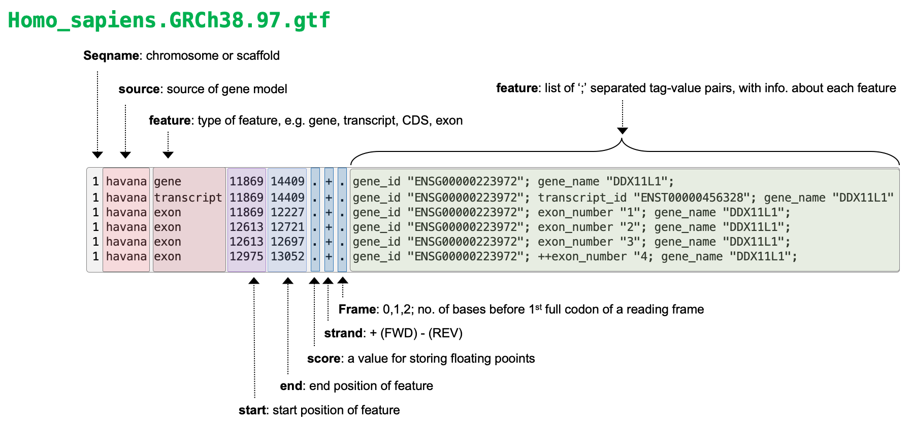

# Working with NGS data Part II

## Alignment files (BAM/SAM/CRAM formats)

### Learning objectives:
- Understand the major principles behind short-read alignment
- Learn how alignment data is stored in SAM/BAM format
- Learn how to perform basic operations on BAM files using `Samtools`
- Perform an alignment with `STAR`

Make a new directory to work in:
```bash
# go to your home directory for the workshop
cd $FOB

# IF YOU DIDN'T HAVE TIME TO FINISH TRIMMING COPY THOSE FILES NOW
mkdir -p $FOB/trim
cp $SOURCE/trim/* $FOB/trim/

# make the directory and cd into it
mkdir -p $FOB/aligned
cd $FOB/aligned
```

## Principles of read mapping for RNA-seq
---

For NGS experiments, the goal of read mapping is to find an alignment that describes the **most likely location in the reference genome where that read originated from**. This is generally determined by reducing the information in the reference and query (read to be mapped) into smaller strings and looking for the position in the reference with the highest number of matching smaller strings. This same process is also used in *de novo* genome assembly, local alignments (BLAST or BLAT), and global alignments.

Although we won't go into the theory here, aligning reads to reference genomes involves **mapping** to identify the most likely position of the read in the reference genome, followed by the **alignment**, which describes the base-by-base relationship between the read and the reference.

<p align="center">

</p>

Challenges of aligning millions of short reads to a reference genome involve:
- Mismatches introduced by genetic variation and sequencing errors
- Repetitive sequences in genomes (e.g. start and end of chromosomes)
- For Eukaryotic genomes the presence of introns in reference genomes, meaning aligners must be able to consider splice-junctions
- For Prokaryotic genomes the presence of mobile genetic elements or recombination hotspots in reference genomes

It is important when selecting an aligner to select one appropriate for your experiment. Different aligners generally have different properties and applications. For example, some aligners are **splice-aware** while others are not. Splice-aware aligners can generate alignments that span intronic regions and therefore account for splicing, e.g. `STAR` and `HISAT2`. If your dataset is prokaryotic (non-splicosomal) you would not want to use a splice-aware aligner, and instead using an aligner that is not designed to map across intronic regions such as `bwa-mem` or `bowtie2`.


### What is a reference genome?

Reference genomes are more of a concept, not a reality. A reference genome (or reference assembly) is an idealized representation of the genome of particular organism, generated through [*de novo* *genome assembly*](https://link.springer.com/referenceworkentry/10.1007%2F978-0-387-09766-4_402) of sequencing reads from one or several individuals. In NGS analysis, we commonly use reference genomes as a scaffold upon which to construct alignments of sequencing reads via read mapping.

Reference genomes have proven a powerful tool that allows us to appropriately address many scientific questions, as well as providing the scientific community a standardized coordinate system for that is used for specific genome builds. For example, the permanent start coordinate for the human gene *CDK9* in reference genome GRCh38/p.13 is chr9:127,786,034.

New genome builds are produced when significant improvements have been made to the sequence, warranting release of an updated sequence with a new coordinate system. For example, genome coordinates are different between GRCh38 and GRCh37. Individual genome builds are sometimes updated through *patches*, for example, when a previously ambiguous sequence becomes available.

<p align="center">

</p>

Image Credit: [Broad Institute](https://gatk.broadinstitute.org/hc/en-us/articles/360041155232-Reference-Genome-Components#:~:text=GRCh38%2Fhg38%20is%20the%20assembly,complex%20variation%2C%20including%20HLA%20loci.&text=The%20ideogram%20is%20from%20the%20Genome%20Reference%20Consortium%20website%20and%20showcases%20GRCh38.)


Reference genomes are generally distributed in FASTA file format, with separate entries for each chromosome/contig in the assembly. Use the code below to explore an a recent version of the human reference genome GRCh38/hg38.

```bash
# print head of FASTA file
head $SOURCE/refs/Homo_sapiens.GRCh38.dna.primary_assembly.fa

# print tail of FASTA file
tail $SOURCE/refs/Homo_sapiens.GRCh38.dna.primary_assembly.fa

# print only header lines for each FASTA record
grep ">" $SOURCE/refs/Homo_sapiens.GRCh38.dna.primary_assembly.fa
```

#### Limitations of reference genomes

There are a number imitations to using reference genomes:  
- do not account for genetic variation, as they are composed of one linear sequence
- short-read sequencing technology has been used to generate some references, which can lead to inaccuracies or gaps in the assembly of regions that are challenging to assemble (e.g. repetitive regions)
- some assemblies, such as the human reference, do not contain so-called non-reference unique insertions (NUIs), which are unique sequences found in multiple individuals but not in the reference

These limitations have resulted in productive discussion and research around the concepts and utilities of reference genomes, prompting some alternative reference styles to be suggested. See [Wong *et al*, Nat. Comm. 2020](https://www.nature.com/articles/s41467-020-19311-w) and Ballouz *et al*, Genom. Biol. 2019](https://genomebiology.biomedcentral.com/articles/10.1186/s13059-019-1774-4) for examples.

In recent years, long read sequencing technologies have allowed us to improve the quality and completeness of reference genomes.

#### Sources of reference genomes & genome annotations

Reference genomes are hosted on a number of different websites and often accompanied by genome annotations, which describe the gene/transcript coordinates for that genome. These annotations are the product specific pipelines utilized by large-scale genome annotation projects. [*RefSeq (NCBI)*](https://ftp.ncbi.nlm.nih.gov/genomes/refseq/), [*UCSC*](https://hgdownload.soe.ucsc.edu/downloads.html), and [*Ensembl*](http://ftp.ensembl.org/pub/) all generate genome annotations based on specific annotation pipelines, and currently host annotations for a wide range of organisms.

Genome annotations are most commonly distributed using the GTF (Gene transfer format) file format. We will explore this format in more detail later in the lesson, however we can briefly look at an example annotation file for hg38:
```bash
# print head of GTF file
head $SOURCE/refs/Homo_sapiens.GRCh38.97.gtf

# print tail of GTF file
tail $SOURCE/refs/Homo_sapiens.GRCh38.97.gtf

# print all lines containing CDK9
grep "CDK9" $SOURCE/refs/Homo_sapiens.GRCh38.97.gtf
```

The table below from the [UCSC website](https://genome.ucsc.edu/FAQ/FAQgenes.html#gene) highlights how different genome annotations produced by different annotation pipelines can be with respect to availability of transcript models for human genome build GRCh38/hg38 (as of March 2019).  

<p align="left">

</p>


Several genome annotation project websites will also host current and archived versions of the reference genome sequence. For common genomes, the hosted reference genomes (and their sequences) are identical and come from the same source/submitter. For example, the human genome reference sequences hosted on NCBI, UCSC, and Ensembl all use the sequence provided by the Genome Reference Consortium [(GRC)](https://www.ncbi.nlm.nih.gov/grc) which provides genome assemblies for human, mouse, zebrafish and chicken.

Most reference genomes and genome annotations can be downloaded through ftp sites that allow you to download the FASTA and GTF files using the command line. While there are several ways you can download files from the command line, we used `wget` in the software lesson, here is an example using the `rsync` command. Similar to `cp` the syntax of `rsync` is `rsync SOURCE DESTINATION`.

*Do not run this command - this is only an example*
```bash
# example rsync command with the UCSC ftp site
# the -a option denotes archive mode, the -P option indicates you want to show the progress as files are downloaded
rsync -a -P rsync://hgdownload.soe.ucsc.edu/goldenPath/hg38/hg38Patch11/ ./
```

This is one example, but generally you should follow instructions on downloading references from the website/center hosting them on the ftp site.


## General concepts for read alignment
---

**Read clipping:**  
Aligners are capable of 'clipping' reads from sequence ends if they do not improve the quality of an alignment that exists for the rest of the sequence.  

There are two type of clipping:  
- *Soft-clipping*: bases at 5' and 3' ends of the read will be kept in the read sequence in the BAM file, but are NOT part of the alignment
- *Hard-clipping*: bases at 5' and 3' ends of the read will be removed from the BAM file altogether and are NOT part of the alignment

Such clipping is commonly used by aligners to get rid of sequence contamination, e.g. adapter sequences or polyA tails from mRNAs, so that it does not affect the alignment. This is why you do not necessarily need to be very aggressive in read trimming during the pre-processing steps. Clipping can be very advantageous, but also can potentially cause some issues, read more [here](https://sequencing.qcfail.com/articles/soft-clipping-of-reads-may-add-potentially-unwanted-alignments-to-repetitive-regions/).

**Splicing:**  
As discussed above, numerous aligners exist, consisting of both ***splice-aware*** and ***splice-unaware*** aligners. Splice-aware aligners, such as `STAR` and `HISAT2` will produce alignments spanning splice junctions, which is obviously an important characteristic of RNA-seq data that the aligner needs to be able to account for. Furthermore, if you provide coordinates of splice-junctions to aligners like `STAR`, it can improve the mapping over spliced regions and improve detection of novel splice-functions.


**What input do I need for an alignment?**  
At minimum:  
- `FASTQ` file(s)
- A reference genome (`.fasta`)

Optional:   
- `.gtf` file for the reference genome that species the genomic feature annotation. As mentioned above, if you know where the splice-junctions in your genome are, you can give this to aligners such as STAR and they will use this information to improve the quality of mapping in these regions.



**Alignment file formats**  

Read alignments for NGS data are stored in three major file formats: *SAM (.sam)*, *BAM (.bam)*, and *CRAM (.cram)*.

- **SAM (Sequence Alignment/Map)** files are tab-delimited text formatted files that are human readable (should you dare to look inside).
- **BAM** files are a compressed, binary version of SAM files and are NOT human readable, but are much faster to parse and do complex operations with.
- **CRAM** files are compressed versions of the BAM format, and are not human readable, they are generally only used for storage purposes.

You can read all about the SAM/BAM/CRAM file format specification in the documentation [here](https://samtools.github.io/hts-specs/SAMv1.pdf). As with FASTQ files, you may never need to actually look inside of a SAM/BAM file, but it is important to have an understanding of what information they contain.

Alignment files are composed of two basic sections:
- the header
- the alignments

All header lines start with the `@` symbol. The mandatory flag `@HD` will come first in the header and can be followed by a number of additional flags that represent features of the alignments in the file (e.g. `SO`, indicating reads are sorted by coordinate).

The alignment section contains a number of 'slots' for each read alignment that describe key information about the alignment. 11 slots are mandatory, while others are optional and depend on the aligner used, and the settings used for mapping.

<p align="center">

</p>

SAM/BAM/CRAM files can be viewed, queried, and manipulated using the [Samtools software suite](http://www.htslib.org/), which we will explore the usage of in more detail later in this lesson.


### Notes on select SAM fields:

**FLAG:**  
Encodes important information about the read, for example, is it a *primary*, *secondary*, or *supplementary* alignment. Since a single read will likely have a number of properties that we want to *'flag'*, SAM files use a special way of encoding the FLAG field to pack as much information as possible into a single number. While we won't go into detail on this here, SAM/BAM file use a bit-wise system to combine information across flags into a single integer.

I encourage you to go read more about FLAGs and how they are specified in the SAM/BAM documentation. The Broad institute also provides an [excellent tool](https://broadinstitute.github.io/picard/explain-flags.html) for decomposing SAM flags into the properties of the read that make up a specific `FLAG` value. 

This command will provide basic information on FLAGs from samtools.
```bash
samtools flags
```
The values shown here relate to the [hexadecimal system](https://www.electronics-tutorials.ws/binary/bin_3.html)

**MAPQ:**  
Corresponds to the quality of the mapping. These are calculated in the same way as the Phred scores `Q = -10 x log10(P)`, although are generally considered to be a best guess form the aligner. A MAPQ of 255 is used where mapping quality is not available. Some aligners also use specific values to represent certain types of alignments, which may affect use of downstream tools, so it is worth understanding those that are specific to your aligner.

**CIGAR:**  
An alphanumerical string that tells you information about the alignment. For relatively short reads, these are nice, but for long reads, they are a headache. Numbers correspond to number of bases, and letters correspond to features of those bases.  

Letter key for CIGAR strings:
`M` = match or mismatch  
`S` = soft clip  
`H` = hard clip  
`I` = insertion  
`D` = deletion  
`N` = skipping  

So for example, alignment in row 3 of our SAM file example above (`5S6M`) would describe an alignment where 5 bases are soft-clipped, followed by 6 matching bases.


## Generating alignments
-----

Since the reads we have been working with were generated as part of a eukaryotic RNA-seq experiment, we need to use a splice aware aligner that can generate gapped alignments. [STAR](https://github.com/alexdobin/STAR/blob/master/doc/STARmanual.pdf) (Spliced Transcripts Alignment to a Reference) is a  flexible and efficient short read aligner. We will use STAR as a general example of aligning short reads to a reference genome. Other short read aligners (e.g. `bwa` and `bowtie/bowtie2`) will use different syntax on the command line and you should carefully read the documentation for the aligner you plan to use.

### Constructing a genome index

Short read aligners require you to create an index of your reference genome before you can conduct an alignment. The index is in principle similar to how one might index a book, so that specific items or information can be found more quickly. For the genome index, we are indexing the genome so that the aligner can narrow down where a read may map to and speed up mapping.

Index generation can be time consuming, so we are providing you with a pre-built genome index consisting of only chromosome 20 (hg38). Alignments will therefore only be generated for this chromosome. The code chunk below shows example usage of STAR to create a STAR index of hg38.

```bash
###### DO NOT RUN - EXAMPLE CODE CHUNK ONLY #######
STAR --runThreadN 16 \
  --runMode genomeGenerate \
  --genomeDir hg38_chr20_index \
  --genomeFastaFiles Homo_sapiens.GRCh38.dna.primary_assembly.chr20.fa \
  --sjdbGTFfile Homo_sapiens.GRCh38.97.chr20.gtf \
  --genomeSAindexNbases 11
```

Option details:
- `--runThreadN`: no. of core/threads you want to use
- `--runMode`: the mode you want to run STAR in (for index generation, this should be genomeGenerate)
- `--genomeDir`: directory you want your genome to go to
- `--genomeFastaFiles`: path to genome .fasta
- `--sjdbGTFfile`: path to genome annotation in .gtf format
- `--sjdbOverhang`: default is 100, usually set to the readlength -1

You can find the pre-built index at `/scratch/fund_of_bioinfo/refs/hg38_chr20_index/`. Once you have generated an index, it is best not to do anything with it, except tell STAR where it is when you want to align reads.

### Aligning the reads

We are ready to align the reads from the paired-end FASTQ files `SRR1039508_1.trim.chr20.fastq.gz` and `SRR1039508_2.trim.chr20.fastq.gz`.

```bash
# make a directory for aligned reads and enter it
mkdir -p $FOB/aligned
cd $FOB/aligned

# run splice aware alignment
STAR --genomeDir $SOURCE/refs/hg38_chr20_index \
  --readFilesIn $FOB/trim/SRR1039508_1.trim.chr20.fastq.gz $FOB/trim/SRR1039508_2.trim.chr20.fastq.gz \
  --readFilesCommand zcat \
  --sjdbGTFfile $SOURCE/refs/Homo_sapiens.GRCh38.97.chr20.gtf \
  --runThreadN 1 \
  --outSAMtype SAM \
  --outFilterType BySJout \
  --outFileNamePrefix SRR1039508.
```

Option details:
- `--genomeDir`: the path to the directory with genome indices
- `--readFilesIn`: read files to map to reference alignment
- `--readFilesCommand`: uncompression command to apply to read files
- `--sjdbGTFfile`: the path to the annotation file that includes coordinates of splice-junctions
- `--runThreadN`: number of threads to use in the run
- `--outSAMtype`: (SAM/BAM unsorted/ BAM SortedByCoordinate)
- `--outFilterType`: how mapped reads will be filtered (normal/BySJout)
- `--outFileNamePrefix`: prefix for outfiles generated in the run, notice that this ends in "." so that the suffix of the outfiles is separated from the prefix

> *NOTE:* It usually makes sense to set `outSAMtype` to `BAM SortedByCoordinate`, so that I do not need to convert the default SAM file output by STAR to BAM, then sort it. However, since we want to look inside the file at the alignments, we are creating a SAM first, and will convert to a BAM afterwards.

As with most aligning, there are many options that can be set to control how read mapping is performed and define properties of alignments that can be generated. The settings you need to use depend you your data type and analysis workflow. Always read the documentation for the aligner you are using in detail.

**Alignment output**

Once the alignment has finished, you should have a number of new files in your directory. These are composed of:  
- `Aligned.out.sam` - your alignment file
- `Log.out` - the log of the STAR run
- `Log.final.out` - the summary file of the mapping statistics
- `Log.progress.out` - a summary file that is updated with key mapping statistics as the run progresses
- `SJ.out.tab` - high-confidence splice-functions

There are a number of ways that alignment quality can be assessed, many of them depending on your data type (e.g. RNA-seq, ChIP-seq), and you should always do a detailed post-alignment QC analysis.  Regardless of data type, the most important alignment QC metric is generally the percentage of uniquely mapping reads. For STAR alignments, this metric is included in the `Log.final.out` file.

```bash
cat SRR1039508.Log.final.out
```

### Generate alignments for multiple samples

It would be tedious (and error prone) to repeat the code we used above to perform read mapping for multiple samples. Instead we will use a `while` loop to capture iterate the alignment process over each of our samples. Before we run this loop it's worth breaking down what each line is doing:

1. `ls $FOB/trim/*_1.trim.chr20.fastq.gz |while read x; do` list the forward read files and iterate through each sample. Since we don't want this loop to run twice for each sample (remember reads are paired) we are only specifying the forward read in our regular expression.
2. ``sample=`echo "$x` `` save the file name to the variable sample, you will notice unlike our previous loops we don't want the echo statement to print to the screen instead we want the output of the command to be saved to our new variable `$sample` to do this we use the backticks `` ` `` which tells shell to evaluate the command inside the backticks and then return the result to the line of code. This is similar to how parentheses are used in mathematic equations. 
3. ``sample=`echo "$sample" | cut -d"/" -f3` `` use the `cut` command to split the path on the `/` character and isolate the filename only, which is in the fourth field
4. `` sample=`echo "$sample" | cut -d"_" -f1` `` use the `cut` command to split the filename on the `_` character to get only the sample name, which is the first field
5. `echo processing "$sample"` print the sample name to the screen
6. run the STAR command, here we use the `$sample` variable that we created in steps 1-3 within our command to indicate the FASTQ files to use for mapping and the prefix. You will notice that in the flag where we are indicating the path to the trimmed FASTQ files I use the curly braces `${sample}` but not for the variable `$FOB` at the beginning of the path. When a variable should be interpretted in the middle of a string you need to indicate that to BASH with the curly braces. 
7. `samtools index $sample.Aligned.sortedByCoord.out.bam;` index the aligned file that is produced by STAR
8. `done` finish the loop

```bash
ls $FOB/trim/*_1.trim.chr20.fastq.gz | while read x; do

  # save the file name
  sample=`echo "$x"`
  # get everything in file name before "/" (to remove '$FOB/trim/')
  sample=`echo "$sample" | cut -d"/" -f6`
  # get everything in file name before "_" e.g. "SRR1039508"
  sample=`echo "$sample" | cut -d"_" -f1`
  echo processing "$sample"

  # run STAR for each sample
  STAR --genomeDir $SOURCE/refs/hg38_chr20_index \
    --readFilesIn $FOB/trim/${sample}_1.trim.chr20.fastq.gz $FOB/trim/${sample}_2.trim.chr20.fastq.gz \
    --readFilesCommand zcat \
    --sjdbGTFfile $SOURCE/refs/Homo_sapiens.GRCh38.97.chr20.gtf \
    --runThreadN 4 \
    --outSAMtype BAM SortedByCoordinate \
    --outFilterType BySJout \
    --outFileNamePrefix $sample.

   #index the BAMs for each sample
   samtools index $sample.Aligned.sortedByCoord.out.bam;
done
```
Note that I change `--outSAMtype` to `BAM sortedByCoord` so that we don't have to convert SAM to BAM and run `sort`.

View the STAR alignment reports quickly:
```bash
ls *Log.final.out | while read x; do
   echo Printing $x
   cat $x
done
```

## Working with SAM/BAM files
----

[Samtools](http://www.htslib.org/doc/samtools.html) is an extensive software suite that provides tools for working with alignment files. We will use Samtools to explore our alignments, and demonstrate some common tasks that can be performed using this software. While our alignments were generated from RNA-seq reads, the samtools usage examples below will be applicable to analysis of any NGS data type. As we mentioned previously Samtools is a software suite, meaning there are many commands that each accept different arguments and flags to perform an operation on an alignment file. Lets have a look at the commands available.

```bash
# View the commands available in the Samtools software suite
samtools --help
```

**Samtools viewing**

You can see that all of the available commands are organized into categories for indexing, editing, file operations, statistics, and viewing. Lets start with the viewing function by using samtools with the `view` command and `-H` flag to view the header line of a SAM file.

```bash
samtools view -H SRR1039508.Aligned.out.sam  | head
```

`view` can also be used to print the first few alignments.
```bash
samtools view SRR1039508.Aligned.out.sam | head
```

A commonly used file operation from this tool suite is the `sort` command to sort SAM/BAM files, as many downstream tools will only accept sorted alignment files as input. Here we are using the `-o` flag to indicate the name of the output file.
```bash
samtools sort SRR1039508.Aligned.out.sam -o SRR1039508.Aligned.out.sorted.sam
```

**Samtools file operations**
In practice, we can ask programs like STAR to give us indexed and sorted BAM files as output from the alignment, however this is not the case with all aligners (bwa mem does not offer this option) and in these cases you will have to sort and index files after the alignment is complete. Now that we've looked at the alignments, we should convert our SAM to BAM for indexing and downstream analysis.
```bash
samtools view -S -b SRR1039508.Aligned.out.sorted.sam > SRR1039508.Aligned.out.sorted.bam
```
Take a look at the size difference between the SAM and BAM files you created. 
```bash
ls -lah SRR1039508.Aligned.out.sorted*
```

**Samtools indexing**
We should also index this BAM, which will create a file with the same name, but the suffix `.bai`. Indexing coordinate sorted compressed(BAM/CRAM) files enables fast retrieval of specific regions of interest with tools like `samtools view`.
```bash
samtools index SRR1039508.Aligned.out.sorted.bam
```

**Samtools statistics**
Another useful thing we might want to do with our BAM file is to count how many alignments have specific FLAG types (unique alignments, secondary, unmapped, properly paired). We discussed FLAG types above and as a reminder here is a link to an [excellent tool](https://broadinstitute.github.io/picard/explain-flags.html) for decoding FLAG types. Using the `flagstat` command will provide a summary of the alignment types in the file. 
```bash
samtools flagstat SRR1039508.Aligned.out.sorted.bam
```

We can modify the `view` command with the `-F` flag to filter out specific types of alignments. For example, you might want to produce a new BAM file with only primary alignments (no secondary alignment), you can filter for only primary alignments with the FLAG 256:
```bash
# use -F option in view to filter out reads that were unmapped
samtools view -F 256 SRR1039508.Aligned.out.sorted.bam -o SRR1039508.Aligned.out.sorted.primary.bam


# check flagstats of new file 
samtools flagstat SRR1039508.Aligned.out.sorted.primary.bam

# count number of reads in new file and old file
samtools view -c SRR1039508.Aligned.out.sorted.primary.bam
samtools view -c SRR1039508.Aligned.out.sorted.bam

# count reads with specific flag
### Note: using lower case -f retains alignments with flag specified, upper case -F filters out alignments with that flag  
samtools view -c -f 256 SRR1039508.Aligned.out.sorted.primary.bam
samtools view -c -f 256 SRR1039508.Aligned.out.sorted.bam
```


## Visualizing alignments with IGV
----

Alignments can be visualized using genome browser software such as the Integrative Genomics Viewer (IGV), allowing you to interactively explore alignments to a reference genome and how they overlap with genome annotation (e.g. gene models). This is an extremely useful way to visualize NGS data, and also allows you to review the evidence supporting downstream analysis results generated from aligned reads (e.g. variant calls).

The figure below shows some example alignments for paired-end mouse RNA-seq data visualized using the IGV.

<p align="center">

</p>

Note how the alignments pile up over the exons, which makes sense since these are RNA-seq data where only the transcriptome was sequenced. In these data we expect to see gaps that span the intronic regions. If we had not used a gapped aligner such as STAR, we would have failed to generate many of these alignments. If these data were whole genome assembly we would expect more even coverage of most locations in the genome. 

IGV supports a wide-range of genomic file formats that contain data ranging from simple genomic regions, to complex alignments and signal tracks. File types supported by IGV include:  
* .BAM - alignments  
* .GTF/GFF - genomic features  
* .VCF - variant call format  
* .BED - genomic regions   
* .BIGWIG - signal tracks

We will cover the utilization of some of the other file types in another lesson, but the range of file formats supported by IGV means it is able to facilitate exploration and visualization of virtually all types of genomics data generated from diverse experimental procedures, for example:  

**Reference genomes and annotations**
The IGV server also hosts a number of reference genomes and annotations, meaning you do not need to load your own genome from a file for many model organisms. You can view the list of hosted genomes on their website [here](http://software.broadinstitute.org/software/igv/Genomes). IGV also provide access to data from large consortia-scale projects such as [*ENCODE*](https://www.encodeproject.org/), [*1000 Genomes*](https://www.internationalgenome.org/home), and [*The Cancer Genome Atlas (TCGA)*](https://www.cancer.gov/about-nci/organization/ccg/research/structural-genomics/tcga).

If your genome is not included in the available set through the IGV server, you can load genomes directly into IGV using `Genomes > Load Genome from file`. To visualize gene/transcript annotation for your genome, a GTF/GFF file containing gene, transcript, exon and UTR coordinates for that genome can be loaded using `File > Load From File.` IGV will automatically separate out the sequences in different entries of the FASTA file.

### How do we use IGV?

IGV can be installed and run locally on MacOS, Linux and Windows as a Java desktop application (which is how we will use it today). You should have all downloaded and installed the Desktop version of IGV for the operating system you are working on.

There is now also an [IGV web-app](https://igv.org/app/) that does not use Java and only needs an internet browser, although is generally slower than if you run the Desktop version.

**Note:** This is by no means a comprehensive guide to IGV. Far more functionality exists than we have discussed here, which can be explored in more detail on their website and using the [IGV User Guide](https://software.broadinstitute.org/software/igv/UserGuide).

### The IGV user interface (UI) and basic navigation

The layout of the IGV desktop application is relatively simple and easy to use after you familiarize yourself with the layout of the user interface.

Some of the main UI features include:
* **Currently loaded genome** - Shown in top left. Drop down menu allows you to toggle between pre-packaged genomes or access those available from the IGV server. Genomes can also be loaded using the `File` tab.

* **Current chromosome/contig** - Name of the chromosome, contig, or other sequence type currently being shown. Can be changed using drop down menu.  

* **Current region of chromosome/contig** - Coordinates in the form *chr:start-end* can be copied and pasted here directly to navigate to a region. Gene names can also be used (dependent upon the loaded annotation).

* **Zoom bar** - Zoom in and out of the currently shown region

* **Schematic of currently loaded chromosome or contig** - A red box indicates location of the region you are currently viewing. Full width of current region is shown below, with a scale bar indicating specific coordinates. Both can be used to navigate directly.

* **Gene track** - Shows gene included in currently loaded annotation (Refseq genes in example). Right click track for additional formatting options. Features included in annotation are indicated by thickness (introns, exons, UTRs). Gene orientation is shown with arrows pointing right for FWD/+, left for REV/- strand.


IGV allows you to customize how tracks are presented, and can be modified using `Preferences` found under the `View`tab. Tweaking preference can be useful in a number of ways:

Modifying the window size that IGV will start to load reads at
Changing the types of reads that are masked from viewing (e.g. supplemental reads)
Allowing soft-clipped bases to be shown


### Working with BAM files (alignments) in IGV

BAM files can be loaded using the `File` tab and selecting `Load from file`. We will use an example BAM file that contains a small number of alignments on chromosome 20 (to reduce file size) of *hg19*, generated from low pass whole-genome sequencing of an individual in the [*1000 Genomes Project*](https://www.internationalgenome.org/home)

Load this file in now (located in your github repo directory `Day-2/data/HG00099.chrom20-sub.low_coverage.bam`.)

**Important note:** The **index file** (ending in .bai) needs to be in the same directory as the BAM file for IGV to load it. BAM files are typically very big and the index creates an efficient index, like you would find in the back of a book, that helps us navigate through the file quickly. We created an index file earlier in the lesson with the `samtools index` command.


You can see a large number of reads shown in red and blue. Reads aligning to the FWD strand of the reference are shown in red. Reads aligning to the reverse strand are shown in blue.

A read coverage bar is automatically show above the alignments. The coverage track is a histogram that shows the number of reads covering each base in the visible region.

Zoom in closer to view the *MYLK2* gene.


Now we have zoomed in closer, we can see more detail about the reads (e.g. direction indicated by their arrowhead) and the gene features they cover. Since this is WGS data, it makes sense for alignments to cover exons, introns, UTRs, and intergenic regions. Remember the distribution of the data is determined by the experiment.

To gain more information on specific reads, hover over a single read. Some of this information may look familiar based on our discussions of the BAM file format.


You can also see some features on specific reads are highlighted. IGV uses colors within reads to highlight features of individual bases. For example, IGV will highlight bases that are mismatched compared the reference. Such bases could represent genetic variants.


If you right click in the alignment track, you will see a number of options appear for changing how the alignments are displayed. One useful option is `View reads as pairs`. Provided your data are paired-end, R1 and R2 reads will be connected by a thin gray line, representing a region that exists in the genome, but was not captured by either end of the paired end sequencing, either because the fragment length was larger than the read lengths or because the read spans and intron or long deletion.

Another useful alignment viewing option available from this menu is changing how reads are colored. By default, read are colored according to the strand they are aligned to, which is useful in several contexts, for example, when working with stranded RNA-seq data, however other coloring schemes can be selected, e.g.
- by read group
- by library


Insertions and deletions are also highlighted using a purple I (for insertions) or a horizontal black line (for deletions).


You can start to appreciate how IGV helps identify features of our data, e.g. potential variants. This information could help to inform subsequent analyses. 

> **Note:** This lesson is only designed to serve as an introduction to IGV. The complete functionality is described on in the [IGV User Guide](https://software.broadinstitute.org/software/igv/UserGuide). I encourage you to visit and explore the user guide after completing this tutorial.

If you use IGV in your publications, you should at cite at least the original publication [(found here)](https://www.nature.com/articles/nbt.1754).

Other genome browsers do exist and have various strengths/weaknesses. For example, the [*UCSC Genome Broswer*](https://genome.ucsc.edu/), is an excellent web-based tool that allows you to perform many of the same visualizations that you would using IGV using your own data, and also provides access to a large collection of hosted datasets. The major advantage of IGV is the ease and speed with which it allows you to explore your own data, which can be slower to explore using a web-based tool.

## Break out room exercises
-----

- Convert the SAM file to a BAM file

- Convert the SAM file to a CRAM file

- How much space does each file take up?

- What is the best way to store the aligned file to minimize the space constraints?

- Look at one of your alignments in the IGV, make sure to load the correct version of the genome for this annotation (hg38). Remember these data only have reads mapped to chromosome 20.

- What happens if you load the older version of the human genome (hg19)? Does the distribution of the data make sense? Why?

-----

If you got lost, or didn't have enough time to finish the commands before we move to the next session, you can copy the files needed for the next step with the following command.

```bash
# go to your scratch directory (e.g. $FOB)
#make a directory to store aligned files
mkdir -p $FOB/aligned

# copy files
cp $SOURCE/aligned/* $FOB/aligned/
```

