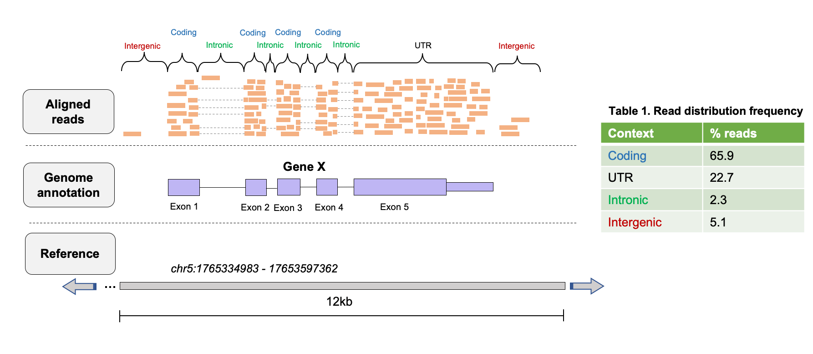
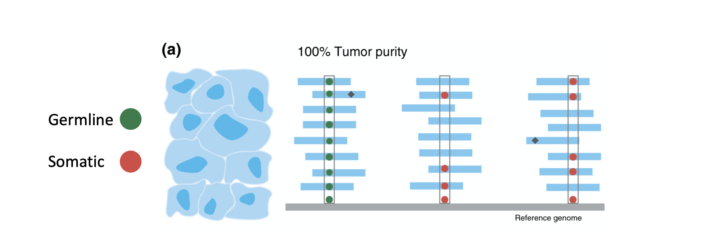
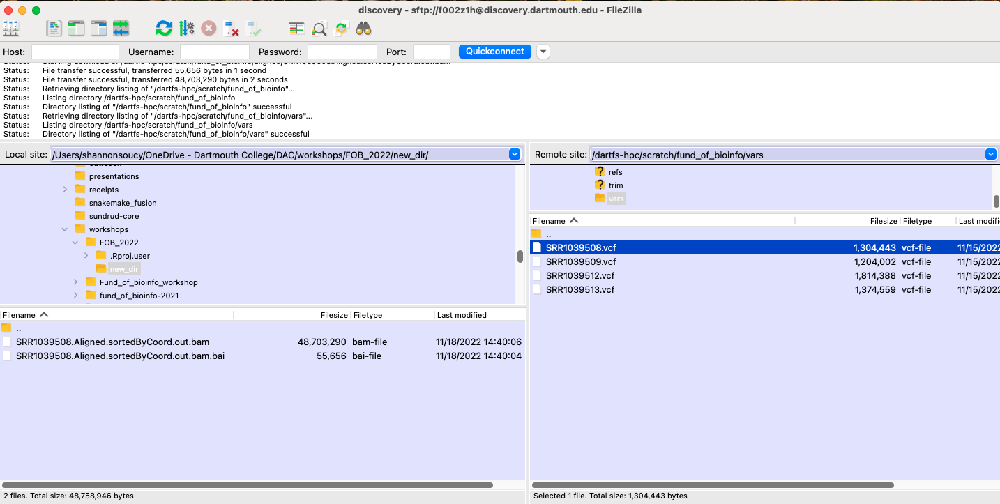
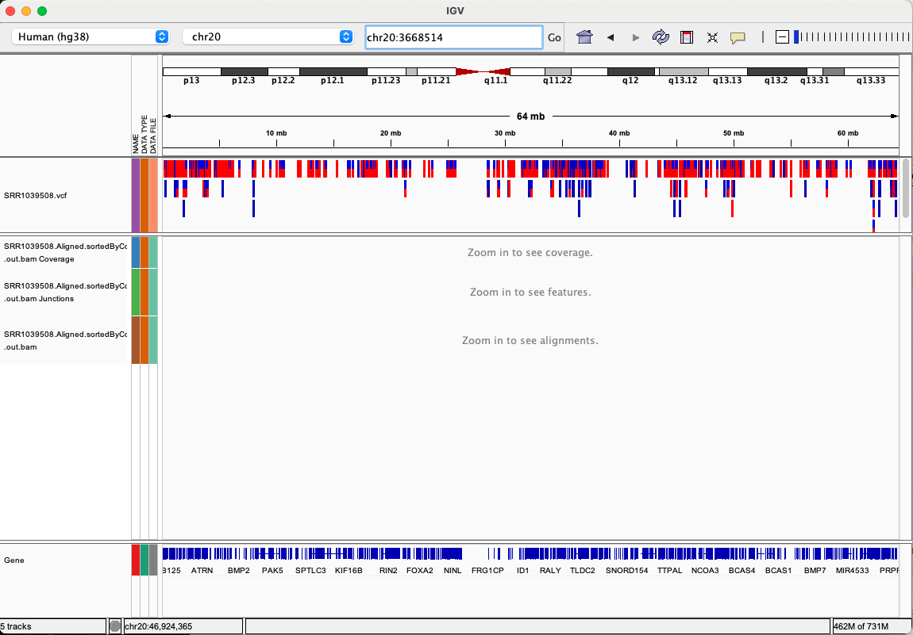
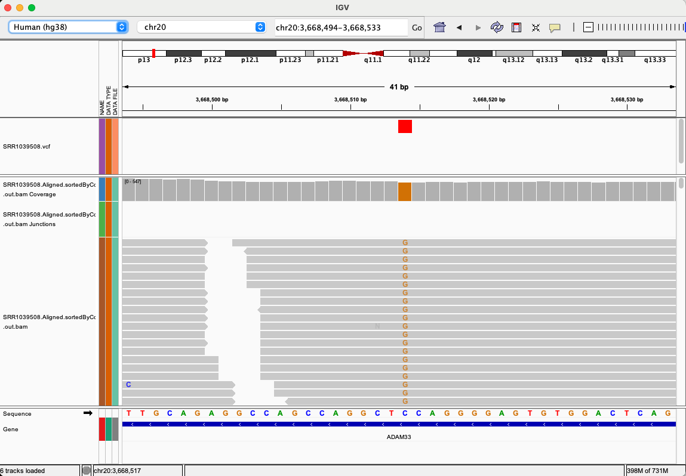
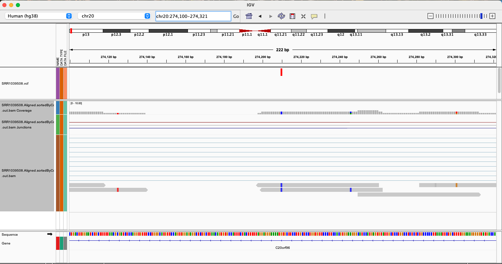
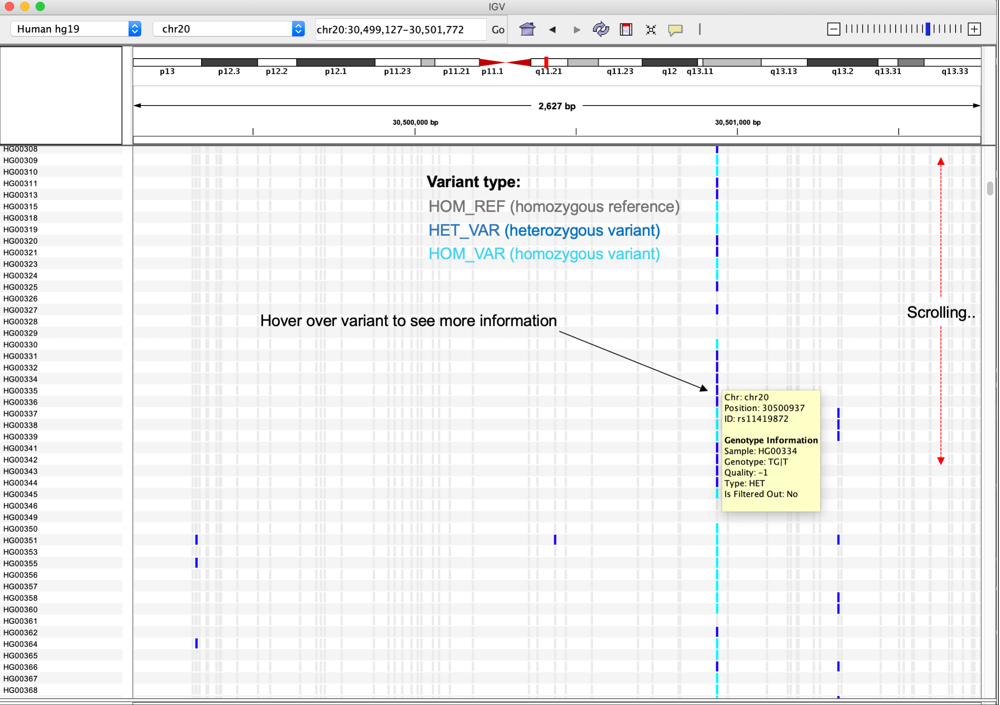

# Working with NGS data Part III

## Introduction
After generating read alignments to your genome of interest, there are several downstream analysis tasks that can be performed to represent the final reduced representation of the dataset. How we use the read alignments to generate the reduced representation of the dataset is dependent on the hypothesis we are testing. Two very common tasks that are performed on alignments are *read quantification* and *variant calling*.

**Read quantification:**
- Often referred to as read counting, several NGS applications require us to count reads overlapping specific features to extract insights. For example, in RNA-seq, the number of reads overlapping each gene is used to infer expression level.

**Variant Calling:**
- In WGS/WES experiments, we are usually interested in identifying genetic variants that are present in a sequenced sample, but not in teh reference genome that the sample was aligned to.

---

## Learning Objectives: 
- Understand the concept of read quantification/counting and the downstream applications this is useful for 
- Learn how to perform a simple read count quantification using [htseq-count](https://htseq.readthedocs.io/en/release_0.11.1/count.html)
- Understand why raw read counts must undergo normalization before making any inferences on the data 
- Understand the basic premise of variant calling from NGS read alignments 
- Learn how to generate putative variant calls with [FreeBayes](https://github.com/freebayes/freebayes) and explore the results using IGV 

---

## Lesson setup: 

If you got lost or missed the last session you can copy all of the files we built in the alignment section with the following commands.
```bash
# IF YOU'RE JUST LOGGING ONTO DISCOVERY

#log on to a compute node if not already on one:
srun --nodes=1 --ntasks-per-node=1 --mem-per-cpu=4GB --cpus-per-task=1 --time=08:00:00 --partition=preempt1 --account=DAC --pty /bin/bash
source ~/.bash_profile

# activate the conda environment
conda activate bioinfo

#create a variable for the source directory 
SOURCE="/dartfs-hpc/scratch/fund_of_bioinfo"

# If you didn't have time to finish aligning copy these files now
mkdir -p $FOB/aligned
cp $SOURCE/aligned/* $FOB/aligned/
```
---

## Part 1: Read count quantification

For most downstream analyses in RNA-seq, especially differential expression, we want to know how many reads aligned to a specific feature, as this tells us about the features's expression level, so we can compare expression between samples. Inherently, this means that we want to make these data count-based, so that we can use statistical models to compare these counts between experimental conditions of interest.

<p align="center">

</p>


Read quantification methods generally require two inputs:  
- an alignment file (.bam)
- a set of features over which to count (e.g. GTF/GFF).

Recall that a GTF/GFF file is used to store genome annotation data, therefore contains the coordinates over all of the exons that we want to count reads.

The most simplistic methods (e.g. [htseq-count](https://htseq.readthedocs.io/en/release_0.11.1/count.html), [featureCounts](http://subread.sourceforge.net/)) use a specific set of rules to count the number of reads overlapping specific features. These are a good choice if your data is less complex, e.g. 3'-end data. More complex methods or read quantification such as [RSEM](https://deweylab.github.io/RSEM/), determine the probability that a read should be counted for a particular feature, this is helpful if you're interested in something like differences in isoform expression data.

Here we will demonstrate gene level quantification with [htseq-count](https://htseq.readthedocs.io/en/release_0.11.1/count.html) to quantify reads for the alignments we created in the previous lesson. Some important options in *htseq-count* include:

**Feature type (`-t`):**  
Specifies the feature in your GTF file you want to count over (3rd column). The default is **exon**. However, this can be changed to any feature in your GTF file, so theoretically can be used to count any feature you have annotated.

**Strandedness (`-s`):**  
Specifies if reads in your experiment come from a stranded (`yes`) or unstranded (`no`) library type. It is critical to set this correctly, as incorrect selection will result in needlessly throwing away 50% of your reads.  

```bash
# go to your scratch dir
cd $FOB

# make a new directory to store your data in
mkdir -p  $FOB/counts
cd $FOB/counts

# quantify reads that map to exons (default)
htseq-count \
-f bam \
-s no \
-r pos \
-t exon \
$FOB/aligned/SRR1039508.Aligned.sortedByCoord.out.bam \
$SOURCE/refs/Homo_sapiens.GRCh38.97.chr20.gtf > SRR1039508.htseq-counts
```

Have a look at the resulting file.
```bash
# how many lines
wc -l SRR1039508.htseq-counts

# first few rows
head SRR1039508.htseq-counts

# importantly, lets check the last few rows as these contain some important info
tail -n 12 SRR1039508.htseq-counts
```

This process can be repeated for each sample in your dataset, and the resulting files compiled to generate a matrix of raw read counts that serve as input to downstream analysis (e.g. differential expression or binding analysis).
```bash
ls $FOB/aligned/*.Aligned.sortedByCoord.out.bam | while read x; do

  # save the file name
  sample=`echo "$x"`
  # get everything in file name before "/" (to remove '$FOB/alignment/')
  sample=`echo "$sample" | cut -d"/" -f6`
  # get everything in file name before "." e.g. "SRR1039508"
  sample=`echo "$sample" | cut -d"." -f1`
  echo processing "$sample"

  # quantify reads that map to exons (default)
  htseq-count \
   -f bam \
  -s no \
  -r pos \
  -t exon \
  $FOB/aligned/$sample.Aligned.sortedByCoord.out.bam \
  $SOURCE/refs/Homo_sapiens.GRCh38.97.chr20.gtf > $sample.htseq-counts;
done
```

#### Sources of variation in RNAseq counts data

In an RNAseq experiemnt like this one, the ultimate goal is to find out if there are genes whose expression level varies by conditions in your samples. The output from HTseq-count contains raw gene counts which cannot be compared within or between samples. This is due to many sources of variation within the counts that should be accounted for with normalization before counts are compared.

**Gene length:**
For comparisons within a sample it is important to normalize for gene length. If gene X is 1000bp long and gene Y is 2000bp long, we would expect that gene Y will recruit twice the reads in the dataset, purely due to the extra bp that represent the gene. If we didn't normalize for gene length and compared raw counts we might incorrectly assume that gene Y was expressed twice as much as gene X. This type of normalization is not needed for single end datasets, as reads are only mapped to the 3' end of the gene and counts will not be affected by genen length. 

**Library size:**
For comparisons between samples it is important to normalize for library size. If sample A has 10 million reads and sample B has 30 million reads and we want to compare the expression of gene X between samples we should first normalize for sequencing depth, else we may incorrectly assume that the expression of gene X in sample B is three times higher than in sample A. 

**Library composition:**
The presence of differentially expressed genes between samples causes the number of reads for other genes in those samples to be skewed. For example, lets assume two samples 1 & 2 and genes X, Y, & Z. Each sample has a library size of 10 million reads but gene Y is differentially expressed between the two samples, with much higher expression in sample 1. The high expression of gene Y in sample 1 leaves fewer reads available to map to genes X and Z, resulting in a low read counts in sample 1 relative to sample 2. The cause of the difference in expression levels of genes X and Z is the increased recruitment of reads to gene Y in sample 1. 

<p align="center">

</p>

Such library composition effects must also be accounted for during normalization to avoid falsely interpreting compositional effects as true differential expression findings. If samples you wish to compare are very distinct in their gene expression profiles, such as comparing drug-treated samples vs untreated samples, compositional effects may be large, therefore effectively correcting for these effects becomes critical for appropriate interpretation.

#### Normalization methods

It is beyond the scope of this workshop to discuss the mathematical formulas that are used to normalize RNAseq counts data, but below is a table describing common methods for normalizing data and what source of variation each method accounts for. We cover data normalization methods in more detail in our summer workshop series *RNAseq Data Analysis**.

**Method** | **Name** | **Accounts for** | **Appropriate comparisons**
-------|-------|-------|-------
CPM | Counts per million | Depth	 | - Between-sample<br>- Within experimental group
TPM | Transcripts per million | Depth & feature length | - Between- and within-sample<br>- Within experimental group
RPKM/FPKM | Reads/fragments per kilobase<br>of exon per million | Depth & feature length | - Within-sample<br>
RLE (DESeq2)|Median of ratios | Depth & library composition | Between sample
TMM (edgeR)| Trimmed mean of M-values| Depth & library composition | Between sample

---

## Part 2: Variant calling

Following an experiment such as Whole Genome Sequencing (WGS) or Exome Sequencing (WES) and subsequent read alignment, a common next step is variant calling. **Genomic variants** are locations in the sequenced samples where the sequenced reads differ from the reference genome to which they have been aligned.  

<p align="center">

</p>

Common software for variant calling includes Genome Analysis Toolkit, Mutect, Freebayes, Varscan, and Strelka. The purpose of these softwares is to determine which variants are real, or which might be artifacts of sequencing error or alignment error, and output a score associated with that determination.  

Any of these variant callers will require as input an aligned BAM file and a reference genome file.  Some expected optional parameters might be a list of sites to mask (such as known repetitive sites in the genome or known germline variants in a population), the expected ploidy of the sequenced sample, or a `GTF` file for annotating the genome context of each variant.

Here we will demonstrate variant calling with [FreeBayes](https://github.com/freebayes/freebayes) a bayesian variant detector to call SNPs, indels, and structural variants on an alignment file. The simplest operation of *freebayes* requires a reference file in fasta format and an alignment file. Some additional options when running *freebayes* are:

**Reference file (`-f`):**  
Specifies the fasta file to use as a reference.

**Alignment file (`-b`):**  
Specifies the alignment file to use as input. 

**Output file (`-v`):**
Specifies the name of the VCF output file.

**Region (`-r`):**
Specifies the region of the reference file to call variants, this argument accepts a chromosome name (chr20) or a chromosome name with positions (Chromosome20:10000-15000). You will need to make sure that the chromosome naming scheme matches with the name in the reference file (i.e. Chr20, chr20, or Chromosome20).


```bash
# go to your scratch dir
cd $FOB

# make a new directory to store your data in
mkdir -p  $FOB/vars
cd $FOB/vars

#check the naming syntax of the reference file 
grep ">" $SOURCE/refs/Homo_sapiens.GRCh38.dna.primary_assembly.chr20.fa

# call variants on chromosome 20
freebayes \
-f $SOURCE/refs/Homo_sapiens.GRCh38.dna.primary_assembly.chr20.fa \
-r 20 \
-v $FOB/vars/SRR1039508.vcf \
-b $FOB/aligned/SRR1039508.Aligned.sortedByCoord.out.bam 
```
The standard file format output by variant callers is `Variant Call Format`, or `VCF`, which is a tabular format containing the genomic location of each variant and the level of evidence for it in each sample, as well as a header describing the construction of the file.

<p align="center">

</p>

Have a look at the VCF file.
```bash
# how many lines
wc -l SRR1039508.vcf

# take a look at the header lines - lines all start with #
grep "^#" SRR1039508.vcf

# take a look at some of the variant calls 
grep -v "^#" SRR1039508.vcf|head -n3
```
Of note are two fields of information that are particularly useful: 

**AF** 
indicates the alternate allele frequency in the dataset and can take on a value of 0, 0.5, or 1. The 

**DP**
indicates the read depth at that site

You will notice the first three variants that we looked at all have an alternate allele frequency of 1, indicating full penetrance of the SNP, however the depth at each of these sites is between 2-3 reads. This isn't a SNP I would be particularly confident about reporting. Let's look for a SNP that we might have some confidence in by pulling any variant that has an alternate allele frequency of 1 and looking for a depth of more than 100 reads at that site. 

```bash

# count the number of variants with a frequency of 1
grep -v "^#" SRR1039508.vcf|grep ";AF=1;"|wc -l

# pull out the depth field and count how many instances of each depth there are, sort by least frequent depth to most frequent depth
grep -v "^#" SRR1039508.vcf|grep ";AF=1;"|cut -d ";" -f8|sort |uniq -c|sort -n

```

You can see that in this dataset most of the SNPs called with and alternate allele frequency of 1 are in sites with very low coverage, though there are some site with hundreds of reads that represent the SNP call. Lets pull out the position of one of those SNPs on chromosome 20 and investigate the SNP further in IGV.

```bash

#pull out the position of the SNP with AF=1 and DP=425
grep -v "^#" SRR1039508.vcf|grep ";AF=1;"|grep "DP=425"|cut -f2

```

Using filezilla download the VCF file from your `vars/` directory as well as the BAM file and indexed BAM file from your `aligned/` directory to your local machine and load them both into the IGV.
 

<p align="center">

</p>


Load the data into IGV using the `File` menu and selecting `Load from File...`, this will bring up the finder window and you can navigate to the directory that contains your data. You MUST have the indexed BAM file (ends in .bai) in the same directory as the BAM file for IGV to load the file. Load both the BAM file and the VCF file, once your data are  in IGV you should see something like this (IGV version 2.15.2 default settings).

<p align="center">

</p>


Next we need to navigate to the position of the alternate allele we want to verify, recall this SNP was at position 3668514. Type `chr20:2668514` into the position window and hit enter. This will automatically center the position of interest on your screen. You can see that the alternate allele (G) is present in the *ADDAM33* gene and all but one read at this position carry the SNP, thus it is very unlikely that this SNP is due to a sequencing error. 

<p align="center">

</p>

Now lets have a look at one of the lower confidence reads we saw at the top of the VCF file, position 274210. You can see that this region represents an intron in the *C20orf96* gene, and that though all reads carry the SNP ther are only 2 reads mapping here. This probably doesn't represent a SNP that is affecting the genotype of the cell. 

<p align="center">

</p>


Other cannonical applications of VCF data might include:
- Confriming all ALT reads are not strand-specific
- Mapping qualities and base qualities are consistent across reads representing the REF & ALT allele
- Variants are not called only at ends of reads

-----

It isn't exactly surprising that there aren't many SNPs with high frequency and high covereage, these RNAseq data are from untreated airway smooth muscle donor cell lines. However the same analysis procedure applied to a cancer data or population genetics might be quite informative. The example VCF file (`Day-2/data/1000G.chr20.sub.vcf.gz`) contains all called variants across subjects in the 1000 Genomes project. All variants for chromosome 20 are summarized at the top of the variant track. This VCF file also includes subject-specific genotypes, represented here using the colors indicated in the figure below.




Once variant calling is performed and a confident set of variants is determined for each sample, some downstream analyses could include:
- comparing variants found in tumor vs. normal pairs
- variants found in resistant vs. non-resistant cell lines
- statistical analysis of the presence of variants in any case-control disease populations.


### Breakout Room activities
---

- Build a code loop for running variant calling on all 4 samples using the following framework

```bash
ls $FOB/aligned/*.Aligned.sortedByCoord.out.bam | while read x; do

  # save the file name
  sample=`echo "$x"`
  # get everything in file name before "/" (to remove '$FOB/alignment/')
  sample=`echo "$sample" | cut -d"/" -f6`
  # get everything in file name before "." e.g. "SRR1039508"
  sample=`echo "$sample" | cut -d"." -f1`
  echo processing "$sample"

  # call variants on chromosome 20
  # remember to add flags for the reference, input BAM file, and output VCF file
  # use the freebayes --help command to remind you what the flags each do

;
done
```
- Take a look at the VCF file for DEX treated sample SRR1039509. Are there more SNPs than in sample SRR1039508 (untreated)? Would you expect there to be?
