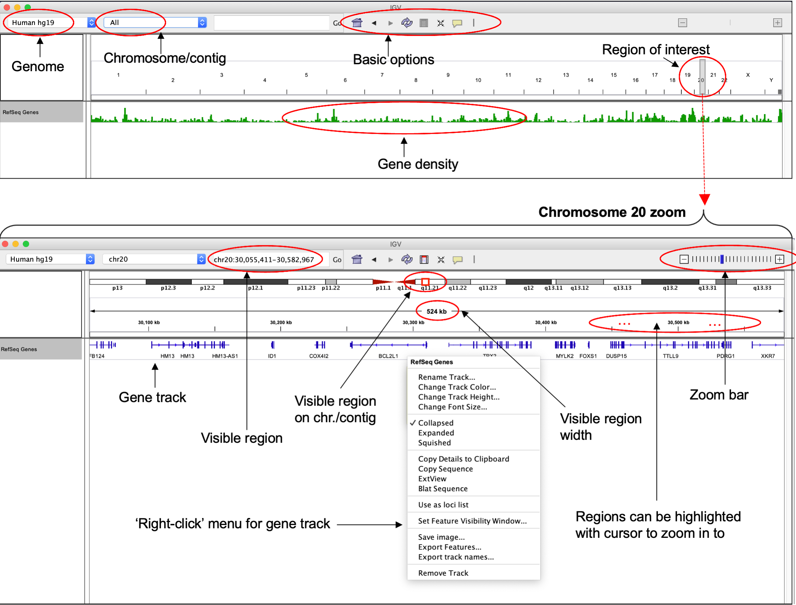
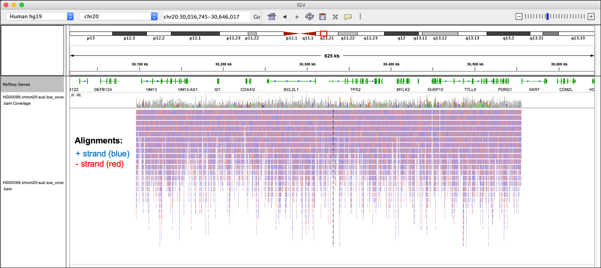
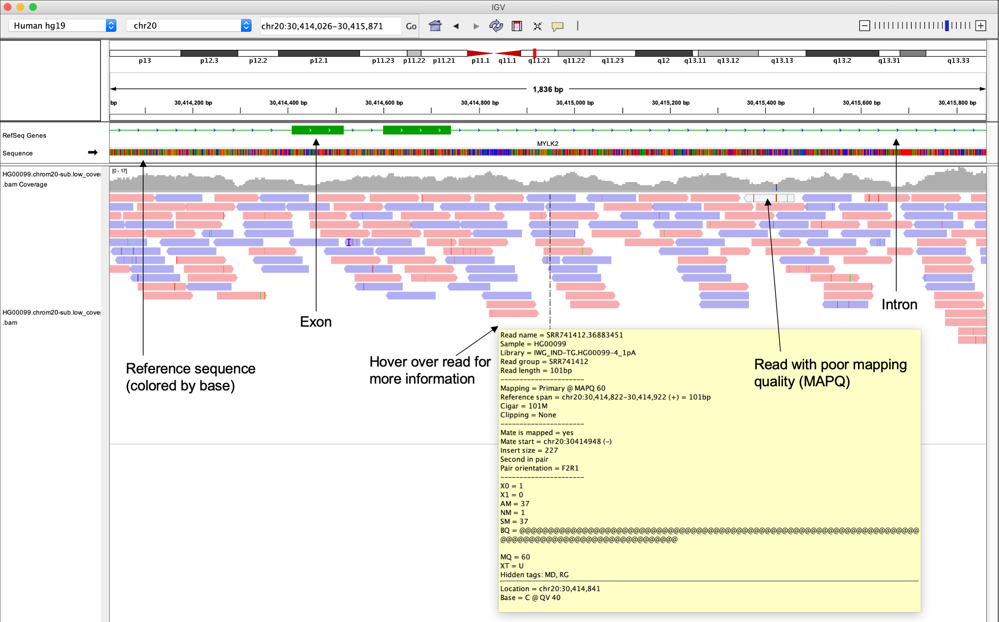
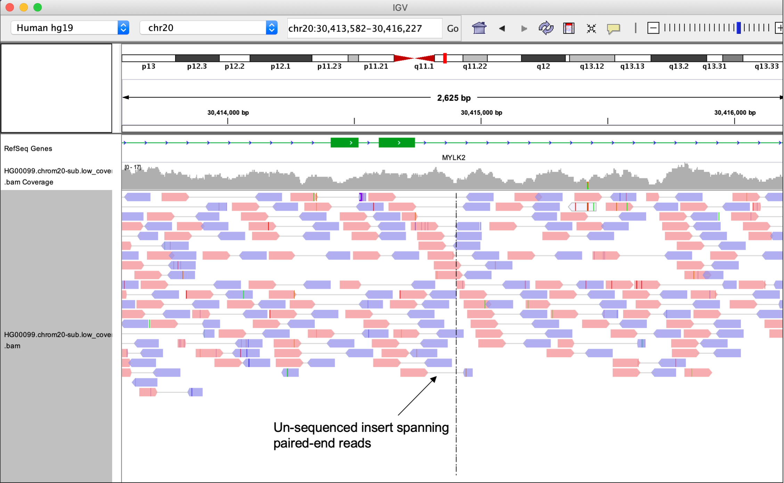
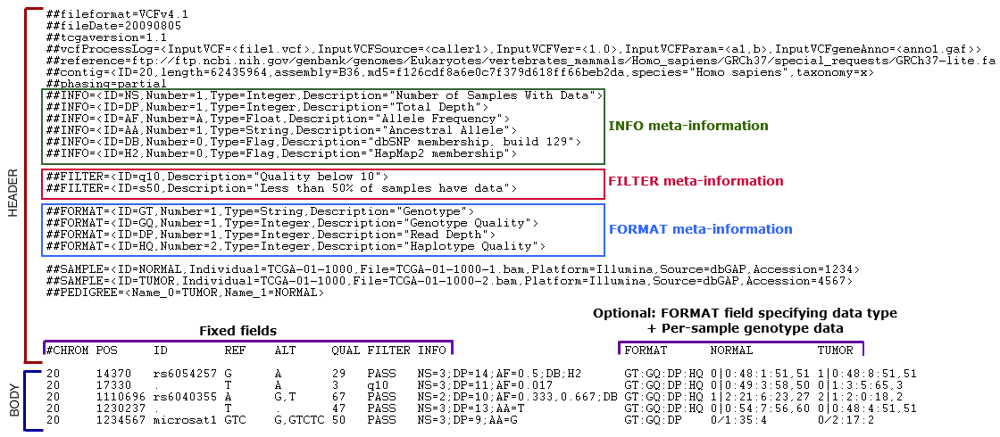
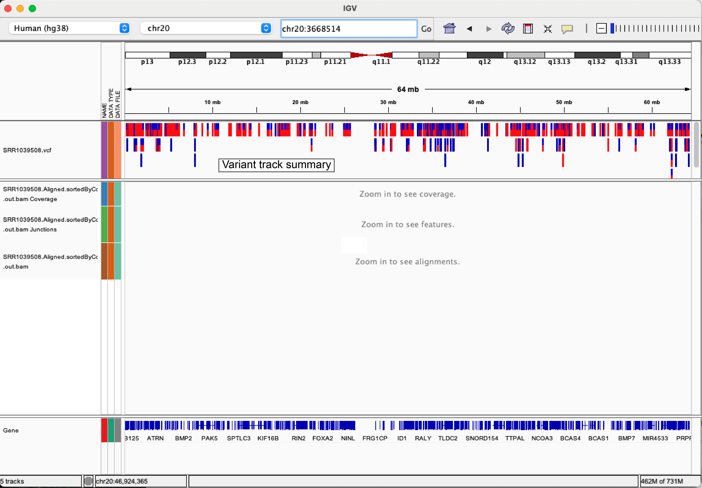
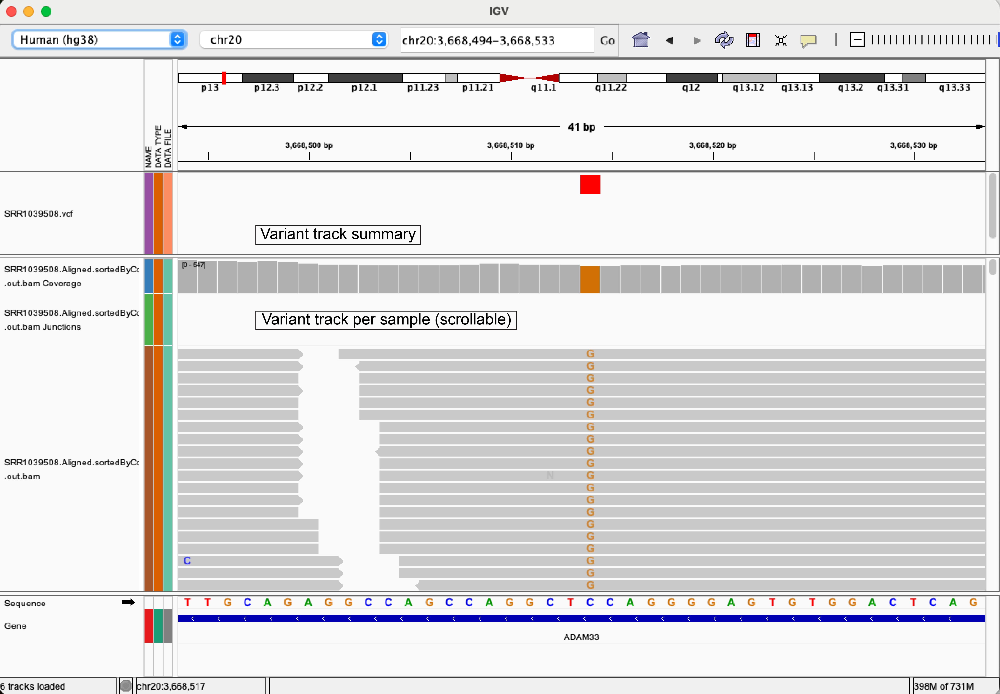

# Working with NGS data Part III

```bash
# IF YOU'RE JUST LOGGING ONTO DISCOVERY
#log on to a compute node if not already on one:
srun --nodes=1 --ntasks-per-node=1 --mem-per-cpu=4GB --cpus-per-task=1 --time=08:00:00 --partition=preempt1 --account=DAC --pty /bin/bash
source ~/.bash_profile

# activate the wokrshop conda environment
conda activate /dartfs/rc/nosnapshots/G/GMBSR_refs/envs/bioinfo

#check that your aliases are defined
echo $FOB
echo $RESOURCE

####################
## If you got lost or missed the last session you can copy all of the files we built in the alignment section with the following commands.

#make a directory to store aligned files
mkdir -p $FOB/align
# copy files
cp $RESOURCE/align/* $FOB/align/
```
---

## Learning Objectives:
- Understand the concept of read quantification/counting and the downstream applications this is useful for
- Learn how to perform a simple read count quantification using [htseq-count](https://htseq.readthedocs.io/en/release_0.11.1/count.html)
- Understand why raw read counts must undergo normalization before making any inferences on the data
- Understand the basic premise of variant calling from NGS read alignments
- Learn how to generate putative variant calls with [FreeBayes](https://github.com/freebayes/freebayes) and explore the results using IGV

---

## Introduction
After generating read alignments to your genome of interest, there are several downstream analysis tasks that can be performed to represent the final reduced representation of the dataset. How we use the read alignments to generate the reduced representation of the dataset is dependent on the hypothesis we are testing. Two very common tasks that are performed on alignments are *read quantification* and *variant calling*.

**Visually inspecting alignments:**
- It is good practice to take a look at your alignments before moving onto further analysis steps, you may be able to identify issues with read mapping before you get confusing results with downstream analysis. For example maybe you indicated your data was stranded but it is not, this would be easily caught when visualizing alignments.

**Read quantification:**
- Often referred to as read counting, several NGS applications require us to count reads overlapping specific features to extract insights. For example, in RNA-seq, the number of reads overlapping each gene is used to infer expression level.

**Variant Calling:**
- In WGS/WES experiments, we are usually interested in identifying genetic variants that are present in a sequenced sample, but not in the reference genome that the sample was aligned to.

---

## Visualizing alignments with IGV
----

Alignments can be visualized using genome browser software such as the Integrative Genomics Viewer (IGV), allowing you to interactively explore alignments to a reference genome and how they overlap with genome annotation (e.g. gene models). This is an extremely useful way to visualize NGS data, and also allows you to review the evidence supporting downstream analysis results generated from aligned reads (e.g. variant calls).

The figure below shows some example alignments for paired-end mouse RNA-seq data visualized using the IGV.

<p align="center">

</p>

Note how the alignments pile up over the exons, which makes sense since these are RNA-seq data where only the transcriptome was sequenced. In these data we expect to see gaps that span the intronic regions. If we had not used a gapped aligner such as STAR, we would have failed to generate many of these alignments. If these data were whole genome assembly we would expect more even coverage of most locations in the genome. 

IGV supports a wide-range of genomic file formats that contain data ranging from simple genomic regions, to complex alignments and signal tracks. File types supported by IGV include:  
* .BAM - alignments  
* .GTF/GFF - genomic features  
* .VCF - variant call format  
* .BED - genomic regions   
* .BIGWIG - signal tracks

We will cover the utilization of some of the other file types in another lesson, but the range of file formats supported by IGV means it is able to facilitate exploration and visualization of virtually all types of genomics data generated from diverse experimental procedures, for example:  

**Reference genomes and annotations**
The IGV server also hosts a number of reference genomes and annotations, meaning you do not need to load your own genome from a file for many model organisms. You can view the list of hosted genomes on their website [here](http://software.broadinstitute.org/software/igv/Genomes). IGV also provide access to data from large consortia-scale projects such as [*ENCODE*](https://www.encodeproject.org/), [*1000 Genomes*](https://www.internationalgenome.org/home), and [*The Cancer Genome Atlas (TCGA)*](https://www.cancer.gov/about-nci/organization/ccg/research/structural-genomics/tcga).

If your genome is not included in the available set through the IGV server, you can load genomes directly into IGV using `Genomes > Load Genome from file`. To visualize gene/transcript annotation for your genome, a GTF/GFF file containing gene, transcript, exon and UTR coordinates for that genome can be loaded using `File > Load From File.` IGV will automatically separate out the sequences in different entries of the FASTA file.

### How do we use IGV?

IGV can be installed and run locally on MacOS, Linux and Windows as a Java desktop application (which is how we will use it today). You should have all downloaded and installed the Desktop version of IGV for the operating system you are working on.

There is now also an [IGV web-app](https://igv.org/app/) that does not use Java and only needs an internet browser, although is generally slower than if you run the Desktop version.

**Note:** This is by no means a comprehensive guide to IGV. Far more functionality exists than we have discussed here, which can be explored in more detail on their website and using the [IGV User Guide](https://software.broadinstitute.org/software/igv/UserGuide).

### The IGV user interface (UI) and basic navigation

The layout of the IGV desktop application is relatively simple and easy to use after you familiarize yourself with the layout of the user interface.

Some of the main UI features include:
* **Currently loaded genome** - Shown in top left. Drop down menu allows you to toggle between pre-packaged genomes or access those available from the IGV server. Genomes can also be loaded using the `File` tab.

* **Current chromosome/contig** - Name of the chromosome, contig, or other sequence type currently being shown. Can be changed using drop down menu.  

* **Current region of chromosome/contig** - Coordinates in the form *chr:start-end* can be copied and pasted here directly to navigate to a region. Gene names can also be used (dependent upon the loaded annotation).

* **Zoom bar** - Zoom in and out of the currently shown region

* **Schematic of currently loaded chromosome or contig** - A red box indicates location of the region you are currently viewing. Full width of current region is shown below, with a scale bar indicating specific coordinates. Both can be used to navigate directly.

* **Gene track** - Shows gene included in currently loaded annotation (Refseq genes in example). Right click track for additional formatting options. Features included in annotation are indicated by thickness (introns, exons, UTRs). Gene orientation is shown with arrows pointing right for FWD/+, left for REV/- strand.





IGV allows you to customize how tracks are presented, and can be modified using `Preferences` found under the `View`tab. Tweaking preference can be useful in a number of ways:

Modifying the window size that IGV will start to load reads at
Changing the types of reads that are masked from viewing (e.g. supplemental reads)
Allowing soft-clipped bases to be shown


### Working with BAM files (alignments) in IGV

BAM files can be loaded using the `File` tab and selecting `Load from file`. We will use an example BAM file that contains a small number of alignments on chromosome 20 (to reduce file size) of *hg19*, generated from low pass whole-genome sequencing of an individual in the [*1000 Genomes Project*](https://www.internationalgenome.org/home)

Load this file in now (located in your github repo directory `Day-2/data/HG00099.chrom20-sub.low_coverage.bam`.)

**Important note:** The **index file** (ending in .bai) needs to be in the same directory as the BAM file for IGV to load it. BAM files are typically very big and the index creates an efficient index, like you would find in the back of a book, that helps us navigate through the file quickly. We created an index file earlier in the lesson with the `samtools index` command.



You can see a large number of reads shown in red and blue. Reads aligning to the FWD strand of the reference are shown in red. Reads aligning to the reverse strand are shown in blue.

A read coverage bar is automatically show above the alignments. The coverage track is a histogram that shows the number of reads covering each base in the visible region.

Zoom in closer to view the *MYLK2* gene.


Now we have zoomed in closer, we can see more detail about the reads (e.g. direction indicated by their arrowhead) and the gene features they cover. Since this is WGS data, it makes sense for alignments to cover exons, introns, UTRs, and intergenic regions. Remember the distribution of the data is determined by the experiment.

To gain more information on specific reads, hover over a single read. Some of this information may look familiar based on our discussions of the BAM file format.



You can also see some features on specific reads are highlighted. IGV uses colors within reads to highlight features of individual bases. For example, IGV will highlight bases that are mismatched compared the reference. Such bases could represent genetic variants.


If you right click in the alignment track, you will see a number of options appear for changing how the alignments are displayed. One useful option is `View reads as pairs`. Provided your data are paired-end, R1 and R2 reads will be connected by a thin gray line, representing a region that exists in the genome, but was not captured by either end of the paired end sequencing, either because the fragment length was larger than the read lengths or because the read spans and intron or long deletion.

Another useful alignment viewing option available from this menu is changing how reads are colored. By default, read are colored according to the strand they are aligned to, which is useful in several contexts, for example, when working with stranded RNA-seq data, however other coloring schemes can be selected, e.g.
- by read group
- by library



Insertions and deletions are also highlighted using a purple I (for insertions) or a horizontal black line (for deletions).


You can start to appreciate how IGV helps identify features of our data, e.g. potential variants. This information could help to inform subsequent analyses. 

> **Note:** This lesson is only designed to serve as an introduction to IGV. The complete functionality is described on in the [IGV User Guide](https://software.broadinstitute.org/software/igv/UserGuide). I encourage you to visit and explore the user guide after completing this tutorial.

If you use IGV in your publications, you should at cite at least the original publication [(found here)](https://www.nature.com/articles/nbt.1754).

Other genome browsers do exist and have various strengths/weaknesses. For example, the [*UCSC Genome Broswer*](https://genome.ucsc.edu/), is an excellent web-based tool that allows you to perform many of the same visualizations that you would using IGV using your own data, and also provides access to a large collection of hosted datasets. The major advantage of IGV is the ease and speed with which it allows you to explore your own data, which can be slower to explore using a web-based tool.


---
## Part 2: Read count quantification

For most downstream analyses in RNA-seq, especially differential expression, we want to know how many reads aligned to a specific feature, as this tells us about the feature's expression level, so we can compare expression between samples. Inherently, this means that we want to make these data count-based, so that we can use statistical models to compare these counts between experimental conditions of interest.

<p align="center">

</p>


Read quantification methods generally require two inputs:  
- an alignment file (.bam)
- a set of features over which to count (e.g. GTF/GFF).

Recall that a GTF/GFF file is used to store genome annotation data, therefore contains the coordinates over all of the exons that we want to count reads.

The most simplistic methods (e.g. [htseq-count](https://htseq.readthedocs.io/en/release_0.11.1/count.html), [featureCounts](http://subread.sourceforge.net/)) use a specific set of rules to count the number of reads overlapping specific features. These are a good choice if your data is less complex, e.g. 3'-end data. More complex methods or read quantification such as [RSEM](https://deweylab.github.io/RSEM/), determine the probability that a read should be counted for a particular feature, this is helpful if you're interested in something like differences in isoform expression data.

Here we will demonstrate gene level quantification with [htseq-count](https://htseq.readthedocs.io/en/release_0.11.1/count.html) to quantify reads for the alignments we created in the previous lesson. Some important options in *htseq-count* include:

**Feature type (`-t`):**  
Specifies the feature in your GTF file you want to count over (3rd column). The default is **exon**. However, this can be changed to any feature in your GTF file, so theoretically can be used to count any feature you have annotated.

**Strandedness (`-s`):**  
Specifies if reads in your experiment come from a stranded (`yes`) or unstranded (`no`) library type. It is critical to set this correctly, as incorrect selection will result in needlessly throwing away 50% of your reads.  

```bash
# go to your scratch dir
cd $FOB

# make a new directory to store your data in
mkdir counts
cd counts

# quantify reads that map to exons (default)
htseq-count \
-f bam \
-s no \
-r pos \
-t exon \
$FOB/align/SRR1039508.Aligned.sortedByCoord.out.bam \
$RESOURCE/refs/Homo_sapiens.GRCh38.97.chr20.gtf > SRR1039508.htseq-counts
```

Have a look at the resulting file.
```bash
# how many lines
wc -l SRR1039508.htseq-counts

# first few rows
head SRR1039508.htseq-counts

# importantly, lets check the last few rows as these contain some important info
tail -n 12 SRR1039508.htseq-counts
```

This process can be repeated for each sample in your dataset, and the resulting files compiled to generate a matrix of raw read counts that serve as input to downstream analysis (e.g. differential expression or binding analysis).
```bash
ls $FOB/align/*.Aligned.sortedByCoord.out.bam | while read x; do

  # save the file name
  sample=`echo "$x"`
  # get everything in file name before "/" (to remove '$FOB/alignment/')
  sample=`echo "$sample" | cut -d"/" -f6`
  # get everything in file name before "." e.g. "SRR1039508"
  sample=`echo "$sample" | cut -d"." -f1`
  echo processing "$sample"

  # quantify reads that map to exons (default)
  htseq-count \
   -f bam \
  -s no \
  -r pos \
  -t exon \
  $FOB/align/$sample.Aligned.sortedByCoord.out.bam \
  $RESOURCE/refs/Homo_sapiens.GRCh38.97.chr20.gtf > $sample.htseq-counts;
done
```

#### Sources of variation in RNAseq counts data

In an RNAseq experiment like this one, the ultimate goal is to find out if there are genes whose expression level varies by conditions in your samples. The output from HTseq-count contains raw gene counts which cannot be compared within or between samples. This is due to many sources of variation within the counts that should be accounted for with normalization before counts are compared.

**Gene length:**
For comparisons within a sample it is important to normalize for gene length. If gene X is 1000bp long and gene Y is 2000bp long, we would expect that gene Y will recruit twice the reads in the dataset, purely due to the extra bp that represent the gene. If we didn't normalize for gene length and compared raw counts we might incorrectly assume that gene Y was expressed twice as much as gene X. This type of normalization is not needed for single end datasets, as reads are only mapped to the 3' end of the gene and counts will not be affected by gene length.

**Library size:**
For comparisons between samples it is important to normalize for library size. If sample A has 10 million reads and sample B has 30 million reads and we want to compare the expression of gene X between samples we should first normalize for sequencing depth, else we may incorrectly assume that the expression of gene X in sample B is three times higher than in sample A.

**Library composition:**
The presence of differentially expressed genes between samples causes the number of reads for other genes in those samples to be skewed. For example, lets assume two samples 1 & 2 and genes X, Y, & Z. Each sample has a library size of 10 million reads but gene Y is differentially expressed between the two samples, with much higher expression in sample 1. The high expression of gene Y in sample 1 leaves fewer reads available to map to genes X and Z, resulting in a low read counts in sample 1 relative to sample 2. The cause of the difference in expression levels of genes X and Z is the increased recruitment of reads to gene Y in sample 1.

<p align="center">

</p>

Such library composition effects must also be accounted for during normalization to avoid falsely interpreting compositional effects as true differential expression findings. If samples you wish to compare are very distinct in their gene expression profiles, such as comparing drug-treated samples vs untreated samples, compositional effects may be large, therefore effectively correcting for these effects becomes critical for appropriate interpretation.

#### Normalization methods

It is beyond the scope of this workshop to discuss the mathematical formulas that are used to normalize RNAseq counts data, but below is a table describing common methods for normalizing data and what source of variation each method accounts for. We cover data normalization methods in more detail in our summer workshop series *RNAseq Data Analysis**.

**Method** | **Name** | **Accounts for** | **Appropriate comparisons**
-------|-------|-------|-------
CPM | Counts per million | Depth	 | - Between-sample<br>- Within experimental group
TPM | Transcripts per million | Depth & feature length | - Between- and within-sample<br>- Within experimental group
RPKM/FPKM | Reads/fragments per kilobase<br>of exon per million | Depth & feature length | - Within-sample<br>
RLE (DESeq2)|Median of ratios | Depth & library composition | Between sample
TMM (edgeR)| Trimmed mean of M-values| Depth & library composition | Between sample

---

## Part 3: Variant calling

Following an experiment such as Whole Genome Sequencing (WGS) or Exome Sequencing (WES) and subsequent read alignment, a common next step is variant calling. **Genomic variants** are locations in the sequenced samples where the sequenced reads differ from the reference genome to which they have been aligned.  

<p align="center">

</p>

Common software for variant calling includes Genome Analysis Toolkit, Mutect, Freebayes, Varscan, and Strelka. The purpose of these softwares is to determine which variants are real, or which might be artifacts of sequencing error or alignment error, and output a score associated with that determination.  

Any of these variant callers will require as input an aligned BAM file and a reference genome file.  Some expected optional parameters might be a list of sites to mask (such as known repetitive sites in the genome or known germline variants in a population), the expected ploidy of the sequenced sample, or a `GTF` file for annotating the genome context of each variant.

Here we will demonstrate variant calling with [FreeBayes](https://github.com/freebayes/freebayes) a bayesian variant detector to call SNPs, indels, and structural variants on an alignment file. The simplest operation of *freebayes* requires a reference file in fasta format and an alignment file. Some additional options when running *freebayes* are:

**Reference file (`-f`):**  
Specifies the fasta file to use as a reference.

**Alignment file (`-b`):**  
Specifies the alignment file to use as input.

**Output file (`-v`):**
Specifies the name of the VCF output file.

**Region (`-r`):**
Specifies the region of the reference file to call variants, this argument accepts a chromosome name (chr20) or a chromosome name with positions (Chromosome20:10000-15000). You will need to make sure that the chromosome naming scheme matches with the name in the reference file (i.e. Chr20, chr20, or Chromosome20).


```bash
# go to your scratch dir
cd $FOB

# make a new directory to store your data in
mkdir vars
cd vars

#check the naming syntax of the reference file
grep ">" $RESOURCE/refs/Homo_sapiens.GRCh38.dna.primary_assembly.chr20.fa

# call variants on chromosome 20
freebayes \
-f $RESOURCE/refs/Homo_sapiens.GRCh38.dna.primary_assembly.chr20.fa \
-r 20 \
-v $FOB/vars/SRR1039508.vcf \
-b $FOB/align/SRR1039508.Aligned.sortedByCoord.out.bam
```

This command will fail with an error indicating `terminate called after throwing an instance of 'std::out_of_range'`. This is a known issue related to splice junctions in either the CIGAR string or the reference sequence (you can read about this error [here](https://github.com/freebayes/freebayes/issues/58)). This issue exists in `freebayes v0.9.20` but has been ammended in later releases of this software. Since we know the issue is rectified in later versions of this software one solution would be to update the version in our conda environment, however there are incompatibilities with the version of python as well as some python dependencies used by other software in this environment. This is an excellent demonstration of why multiple software environments are helpful. Let's exit our current conda environment and activate another one with the updated version of `freebayes v1.9.2`.

```
# check the version of freebayes available
freebayes --version

# exit current conda environment
conda deactivate

# activate new environment
conda activate /dartfs/rc/nosnapshots/G/GMBSR_refs/envs/variant_calling

# check the version of freebayes avaialbe
freebayes --version

# call variants on chromosome 20
freebayes \
-f $RESOURCE/refs/Homo_sapiens.GRCh38.dna.primary_assembly.chr20.fa \
-r 20 \
-v $FOB/vars/SRR1039508.vcf \
-b $FOB/align/SRR1039508.Aligned.sortedByCoord.out.bam
```

The standard file format output by variant callers is `Variant Call Format`, or `VCF`, which is a tabular format containing the genomic location of each variant and the level of evidence for it in each sample, as well as a header describing the construction of the file.

<p align="center">

</p>

Have a look at the VCF file.
```bash
# how many lines
wc -l SRR1039508.vcf

# take a look at the header lines - lines all start with #
grep "^#" SRR1039508.vcf

# take a look at some of the variant calls
grep -v "^#" SRR1039508.vcf|head -n3
```
Of note are two fields of information that are particularly useful:

**AF**
indicates the alternate allele frequency in the dataset and can take on a value of 0, 0.5, or 1. The

**DP**
indicates the read depth at that site

You will notice the first three variants that we looked at all have an alternate allele frequency of 1, indicating full penetrance of the SNP, however the depth at each of these sites is between 2-3 reads. This isn't a SNP I would be particularly confident about reporting. Let's look for a SNP that we might have some confidence in by pulling any variant that has an alternate allele frequency of 1 and looking for a depth of more than 100 reads at that site.

```bash

# count the number of variants with a frequency of 1
grep -v "^#" SRR1039508.vcf|grep ";AF=1;"|wc -l

# pull out the depth field and count how many instances of each depth there are, sort by least frequent depth to most frequent depth
grep -v "^#" SRR1039508.vcf|grep ";AF=1;"|cut -d ";" -f8|sort |uniq -c|sort -n

```

You can see that in this dataset most of the SNPs called with and alternate allele frequency of 1 are in sites with very low coverage, though there are some site with hundreds of reads that represent the SNP call. Lets pull out the position of one of those SNPs on chromosome 20 and investigate the SNP further in IGV.

```bash

#pull out the position of the SNP with AF=1 and DP=425
grep -v "^#" SRR1039508.vcf|grep ";AF=1;"|grep "DP=425"|cut -f2

```

Using filezilla download the VCF file from your `vars/` directory as well as the BAM file and indexed BAM file from your `aligned/` directory to your local machine and load them both into the IGV.


<p align="center">

</p>


Load the data into IGV using the `File` menu and selecting `Load from File...`, this will bring up the finder window and you can navigate to the directory that contains your data. You MUST have the indexed BAM file (ends in .bai) in the same directory as the BAM file for IGV to load the file. Load both the BAM file and the VCF file, once your data are  in IGV you should see something like this (IGV version 2.15.2 default settings).

<p align="center">

</p>


Next we need to navigate to the position of the alternate allele we want to verify, recall this SNP was at position 3668514. Type `chr20:2668514` into the position window and hit enter. This will automatically center the position of interest on your screen. You can see that the alternate allele (G) is present in the *ADDAM33* gene and all but one read at this position carry the SNP, thus it is very unlikely that this SNP is due to a sequencing error.

<p align="center">

</p>

Now lets have a look at one of the lower confidence reads we saw at the top of the VCF file, position 274210. You can see that this region represents an intron in the *C20orf96* gene, and that though all reads carry the SNP there are only 2 reads mapping here. This probably doesn't represent a SNP that is affecting the genotype of the cell.

<p align="center">

</p>


Other canonical applications of VCF data might include:
- Confirming all ALT reads are not strand-specific
- Mapping qualities and base qualities are consistent across reads representing the REF & ALT allele
- Variants are not called only at ends of reads

-----

It isn't exactly surprising that there aren't many SNPs with high frequency and high coverage, these RNAseq data are from untreated airway smooth muscle donor cell lines. However the same analysis procedure applied to a cancer data or population genetics might be quite informative. The example VCF file (`Day-2/data/1000G.chr20.sub.vcf.gz`) contains all called variants across subjects in the 1000 Genomes project. All variants for chromosome 20 are summarized at the top of the variant track. This VCF file also includes subject-specific genotypes, represented here using the colors indicated in the figure below.


Once variant calling is performed and a confident set of variants is determined for each sample, some downstream analyses could include:
- comparing variants found in tumor vs. normal pairs
- variants found in resistant vs. non-resistant cell lines
- statistical analysis of the presence of variants in any case-control disease populations.


### Breakout Room activities
---

- Build a code loop for running variant calling on all 4 samples using the following framework

```bash
ls $FOB/align/*.Aligned.sortedByCoord.out.bam | while read x; do

  # save the file name
  sample=`echo "$x"`
  # get everything in file name before "/" (to remove '$FOB/align/')
  sample=`echo "$sample" | cut -d"/" -f6`
  # get everything in file name before "." e.g. "SRR1039508"
  sample=`echo "$sample" | cut -d"." -f1`
  echo processing "$sample"

  # call variants on chromosome 20
  # remember to add flags for the reference, input BAM file, and output VCF file
  # use the freebayes --help command to remind you what the flags each do

;
done
```
- Take a look at the VCF file for DEX treated sample SRR1039509. Are there more SNPs than in sample SRR1039508 (untreated)? Would you expect there to be?
