# Working with NGS data part IV

## Introduction
Instead of sequencing all available DNA or RNA, we sometimes intentionally isolate specific subsets of DNA/RNA for sequencing analysis. For example, ChIP-seq is used to *'pull-down'* the DNA associated with a specific DNA binding protein, allowing us to identify transcription factor binding sites, for example. Alternatively, ATAC-seq is used to isolate only the accessible regions of DNA, enabling us to identify the landscape of functionally active genomic regions in a sample. 

Such methods also generate read alignments, however using these for **read quantification** or **variant calling** won't tell us which regions of the genome were isolated in the experiment. Instead, we perform an analytical procedure called **peak calling**, where we systematically scan the genome to agnostically identify regions containing read *pile-ups* that we call **peaks**. These peaks represent the regions of DNA/RNA isolated in the experiment. 

---

## Learning Objectives: 
- Understand the basic principles of *peak calling* 
- Familiarize yourself with the *BED* and *BigWig* file formats for storing genomics data 
- Learn how to visualize peak calling results in IGV with the *BED* and *BigWig* file formats 
---


## Peak calling

As introduced above, peak calling algorithms use the aligned reads to scan through a reference genome and identify regions that contain large pile-ups of aligned reads. The regions where these pile-ups exist represent the regions of DNA that were isolated in your experiment. For example, in a ChIP-seq experiment, an antibody is used to obtain the DNA bound by a specific protein. Once this DNA is sequenced and aligned to a reference genome, the peak calling algorithm with reveal the locations of all DNA isolated in the experiment. The resulting peak regions can be used for a range of downstream analysis such as motif finding, gene ontology analysis, and unsupervised clustering. 

<p align="center">
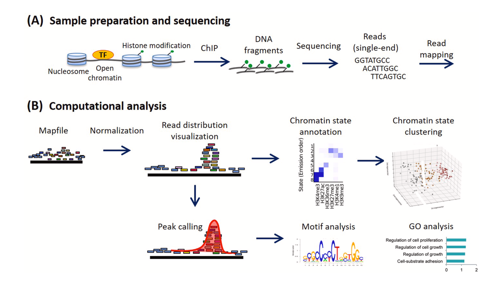
</p>

Adapted from [Nakato & Sakata, *Methods*, 2020](https://www.sciencedirect.com/science/article/pii/S1046202320300591)

In the below example of a ChIP-seq dataset, you can see all the alignments to specific region of chr11 in the mouse genome (reference *mm10*), as well as the peak calls identified by peak called *MACS2*. You can clearly see that the pileups in read density correlate with the called peak regions. 

<p align="center">
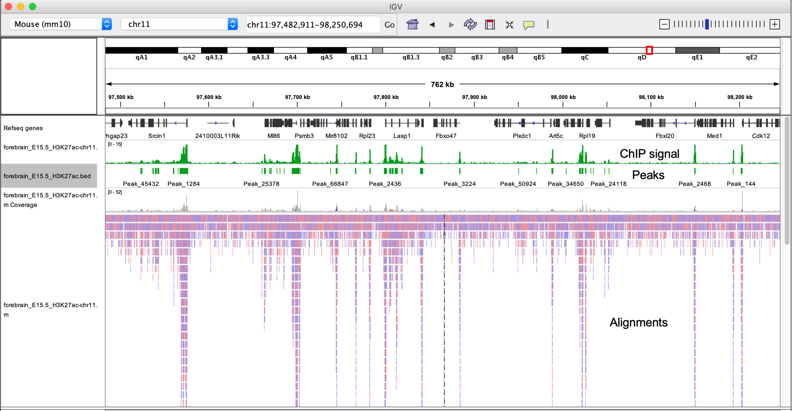
</p>

Alignments generated after mapping short reads from a ChIP-seq experiment to a reference genome generally show asymmetric distribution of reads on the +/- strand immediately around a binding site. By shifting these reads toward the middle, or extending them to the expected fragment length, we can generate a signal profile that is compared to the background signal from the control DNA sample using statistical models, ultimately assigning a probability value (*P*-value) to each peak.

<p align="center">
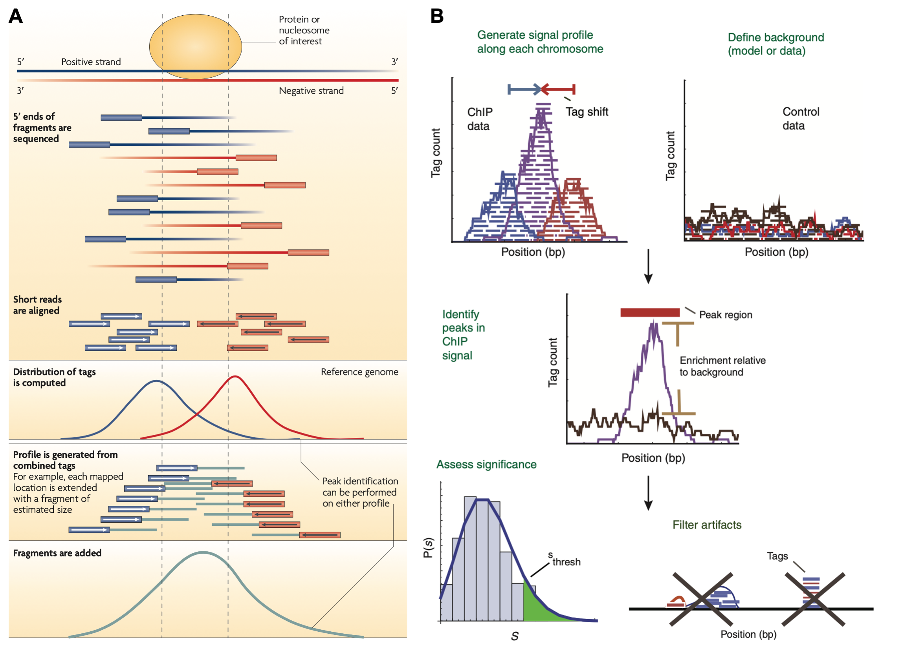
</p>


Part A has been adapted from [Park, *Nature Rev. Gen.*, 2009](https://www.nature.com/articles/nrg2641). Part B has been adapted from [Pepke et al, *Nature Methods*, 2009](https://www.nature.com/articles/nmeth.1371).


> While peak calling is typically associated with ChIP-seq, it is utilized in a growing number of genomic analysis workflows, especially in more recent years as the number of technologies being designed to profile various genomic features grows rapidly.

Below is an example a shell command line usage that you could use to call peaks with MACS2.  

*Do not run this is only an example*
```bash
macs2 callpeak \
	-t sample-1-chip.bam \
	-c sample-1-input.bam \
	-f BAM \
	-g 1.3e+8 \
	--outdir peaks
```

- `t` denotes the file containing enriched sequence tags/alignments
- `c` denotes the file containing control alignments, where no enrichment was performed
- `f` describes the file type of the inputs
- `g` is the total size of the genome
- `--outdir` the file path you want results to be written to

The peaks generated by MACS2 and other peak callers are stored using the **BED (Browser Extensible Data)** file format. BED files are text files used to store coordinates of genomic regions, and can be visualized directly in genome browsers such as UCSC and IGV. Three fields (columns) are required in BED files:
- chrom
- chromStart
- chromEnd

Nine additional optional fields can be provided to include additional information in a bed file. Other 'flavors' of BED files exist, that utilize several of the standard BED file format fields, as well as additional custom fields. `.narrowpeak` files are an example, and are referred to as a BED6+4 file format, as they use the first six columns of standard BED files with an additional 4 custom columns.

<p align="center">
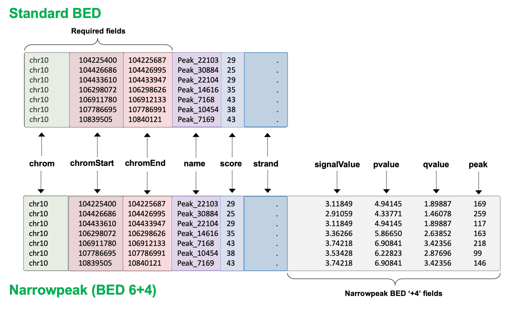
</p>

The [UCSC website](https://genome.ucsc.edu/FAQ/FAQformat.html#format1) is an excellent resource for learning more about BED, narrowpeak, and other genomics file formats.

Lets briefly explore a BED file on the command line. We will use `heart_E15.5_H3K9ac.bed` located in `Bioinformatics_workshop/Day-2/data/` :
```bash
# examine the head and tail of the file
head -n 10 ~/Bioinformatics_workshop/Day-2/data/heart_E15.5_H3K9ac.bed
tail -n 10 ~/Bioinformatics_workshop/Day-2/data/heart_E15.5_H3K9ac.bed

# count number of regions in the file
wc -l ~/Bioinformatics_workshop/Day-2/data/heart_E15.5_H3K9ac.bed
```

> **Note:** The settings and options used to perform peak calling appropriately are dependent on the data you have (e.g. ChIP-seq, ATAC-seq, etc.) and the type of peak you are hoping to detect. TFs usually form narrow punctuate peaks but other marks, such as histone marks, typically form broader peaks, and can require different settings to accurately detect.

After a set of peak regions have been defined, read quantification can be performed over these regions, since these count data can be used as input to a differential binding analysis (ChIP-seq) or a differential accessibility analysis (ATAC-seq), to identify peaks unique to an experimental condition.


### Visualizing signal of enriched sequence tags (alignments)

It is often useful to visualize extent of the signal in identified peak regions, to gain an idea of **how enriched** above background the signal in those regions was.

Visualization of signal track data is usually achieved by converting alignment files (`.BAM` format) into a `bigWig` file, an indexed binary file format used to store dense continuous data (i.e. signal).

`bigWig` files can be constructed from the `wiggle (Wig)` or `bedGraph` file formats, both of which are also used to store dense continuous data. bigWig, Wig, and bedGraph files formats are all described in more detail on the [UCSC website](http://genome.ucsc.edu/goldenPath/help/bigWig.html).

<p align="center">
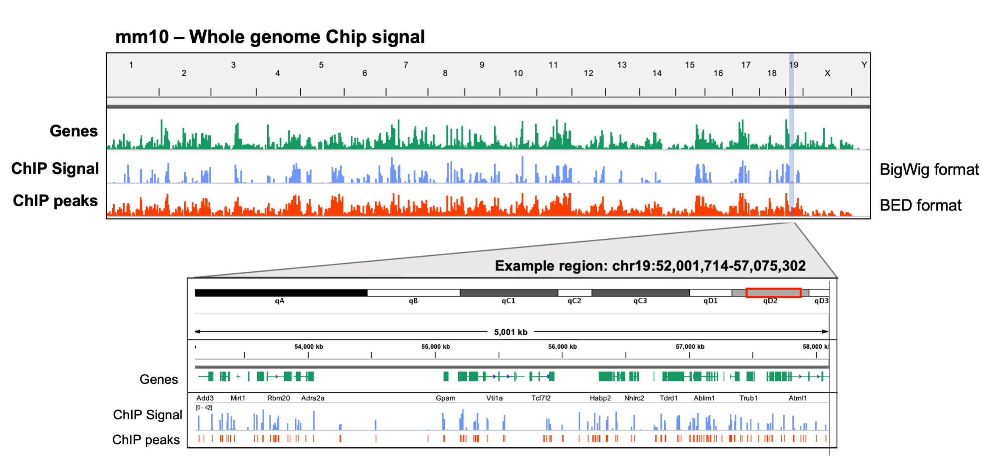
</p>

> For the purposes of this workshop, we only need understand the idea behind of bigwig files and what they are used for. We hope to address their generation and use in more detail in future workshops.

Bigwig files can be used to evaluate signal across many genomic loci simultaneously. A common task is to plot signal directly upstream and downstream of called peaks. Consider the example below:

<p align="center">
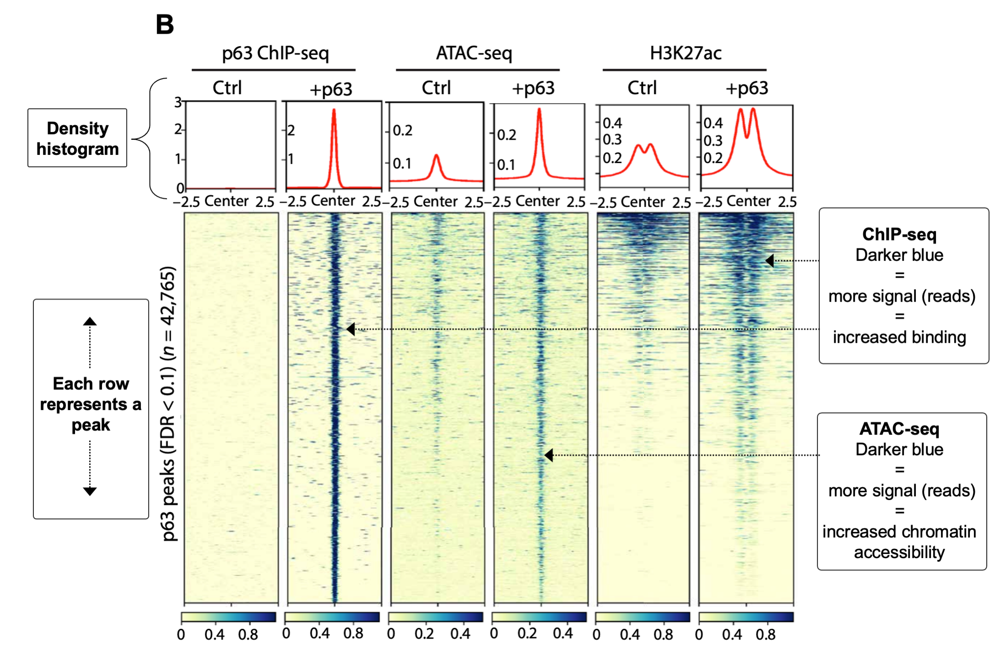
</p>

Adapted from Figure 1 of [Lin-Shiao *et al*, 2019, *Science Advances*](https://advances.sciencemag.org/content/5/5/eaaw0946)

---

## Visualizing signal tracks and genomic regions with IGV

IGV also allows us to visualize a number of other genomic file types beyond BAM and VCF files. Very often in genomics experiments, we are interested in identifying regions of the genome that demonstrate increased signal compared to background. For example, DNA regions immunoprecipitated with a transcription-factor specific antibody in a ChIP-seq experiment.

In such experiments, we are usually interested in **which regions** show increased signal, which we call *peaks* and often store the genomic coordinates for these peaks in BED format.

We are also often in interested in *how much signal* these regions show in comparison to their surrounding regions, and commonly represent these data using the BigWig file format, often referred to as a *signal track*.


|:--:|

Lets read in some example ChIP-seq data (as shown in Figure 11) to demonstrate how you might go about exploring these types of data. We will use data from a recently published study of the dynamic regulatory landscape in the developing mouse ([Gorkin *et al*, 2020](https://www.nature.com/articles/s41586-020-2093-3?proof=t)).

In this study, the authors generate an atlas of the dynamic chromatin landscape at various time points during mouse embryonic development, conducting over 1100 ChIP-seq experiments and 132 ATAC-seq experiments spanning 72 stages of development across various tissues.

**Figure 1A-B from Gorkin *et al*, 2020, Nature**.
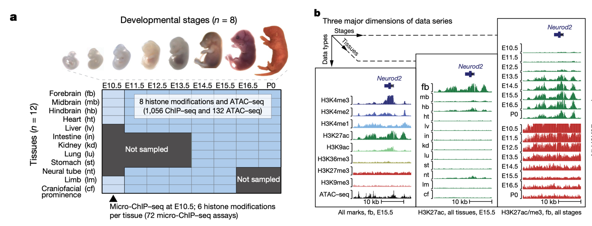

In particular, we will use the ChIP-seq data generated in immunoprecipitation experiments for several histone modifications, whose presence and absence can be used to infer the functional state of chromatin at specific loci (e.g. active transcription, enhancers, heterochromatin). These data have been downloaded and made available in this github repo, in: `Bioinformatics_workshop/Day-2/data/`.

Specifically, we will use ChIP-seq data for two histone modifications that are known to represent transcriptionally active chromatin regions:  
* H3K27ac - Acetylation of lysine 27 of histone 3
* H3K9ac - Acetylation of lysine 9 of histone 3

Since this experiment uses an alignment generated against mouse reference mm10, we need to switch the genome selected in IGV before we load in any data. Then, load in the following files:  
* `forebrain_E15.5_H3K27ac-chr11.bw` - ChIP signal
* `forebrain_E15.5_H3K27ac.bed` - Peak coordinates
* `forebrain_E15.5_H3K27ac-chr11.bam` - Read alignments

Peak regions for the BED file track clearly line up with the ChIP-signal track (.BigWig), and these regions also show high read densities, suggesting signal over the background level (as shown in *Figure 11*).

However, commonly in a ChIP-seq analysis, we are interested in comparing how TF binding sites or histone modifications change between samples. Let's load in some additional data so that we can compare chromatin states in the developing mouse forebrain to heart tissues. Start with the BED files:
* `forebrain_E15.5_H3K27ac.bed`
* `forebrain_E15.5_H3K9ac.bed`
* `heart_E15.5_H3K27ac.bed`
* `heart_E15.5_H3K9ac.bed`

Peaks called for each histone mark in either forebrain or heart tissue are now visible. Use the right click options to set the color of these tracks to aid in visualization. Can you see any regions where the chromatin marks differ between the groups?


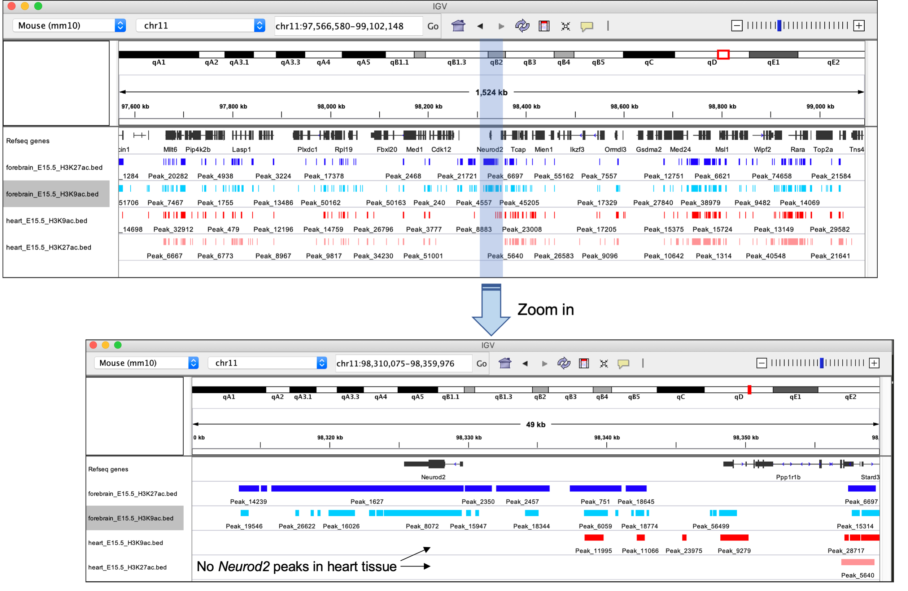
|:--:|

Now use the search bar to navigate to the *Neurod2* gene. Clearly, the presence of peaks in forebrain tissues and the absence in heart suggests this region is only transcriptionally active in the developing forebrain.

However, without any information on the relative ChIP signal at these regions, we don't have any idea of  how transcriptionally active this region is compared to others. For this, we need to load in the signal track data in BigWig format. Load these in from the same directory now.

Bigwig files to load:
* `forebrain_E15.5_H3K27ac.bw`
* `forebrain_E15.5_H3K9ac.bw`
* `heart_E15.5_H3K27ac.bw`
* `heart_E15.5_H3K9ac.bw`

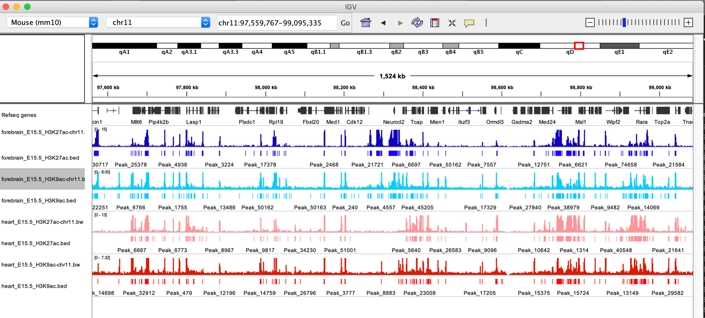
|:--:|

Note the differences in the scales shown at the top left of each signal track. To fairly compare differences between samples, we need to use the same scale. Highlight the signal tracks and right click to select the `Autoscale` option.

Setting signal tracks to be on the same scale is very important when comparing between them. It is also important to know how the data have been normalized, since values that have been normalized in different ways aren't comparable on the same scale anyway (make sure you know what you are looking at).


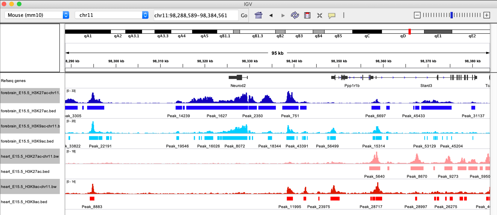
|:--:|

IGV can also be used to compare multiple regions simultaneously using the split view functionality. There are a number of ways the split view can be activated, but perhaps the easiest is using the search bar.

Enter the following into the search bar to activate split view:
`Neurod2 Stat5b Top2a`


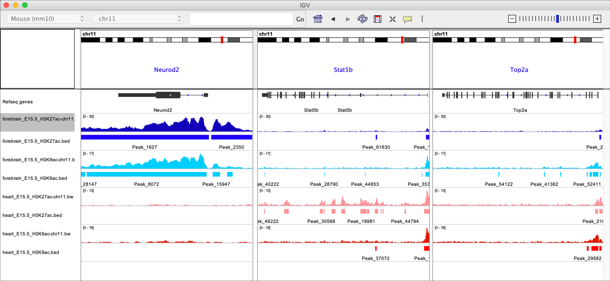
|:--:|

Split view has a number of useful applications, however it is especially useful when reviewing alignment evidence for complex structural variants or translocations (although we won't cover that today).

---

### Saving and restoring sessions in IGV

We did a lot of work loading in all these data and setting everything up just how we want it. It would be a shame to have to do this every time we want to revisit these data. Fortunately, IGV allows you to save sessions, allowing you to re-load everything just as you had it before.

Try saving the current session using `Save session...` under the `File` tab.


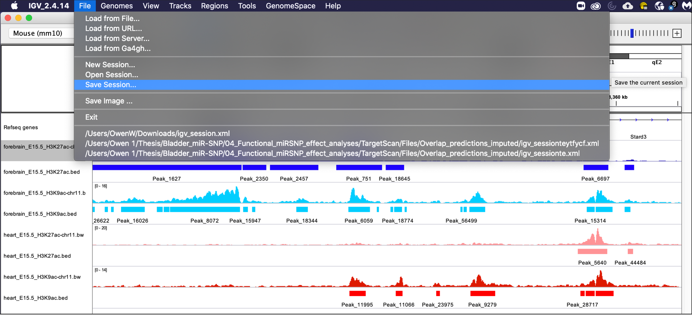
|:--:|

---

