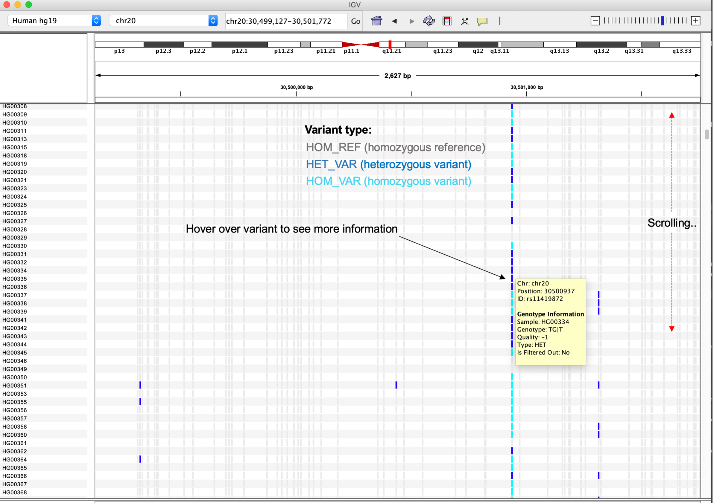
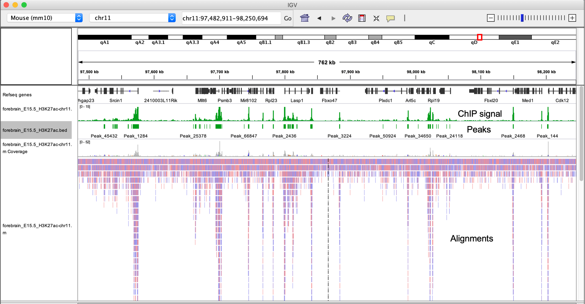
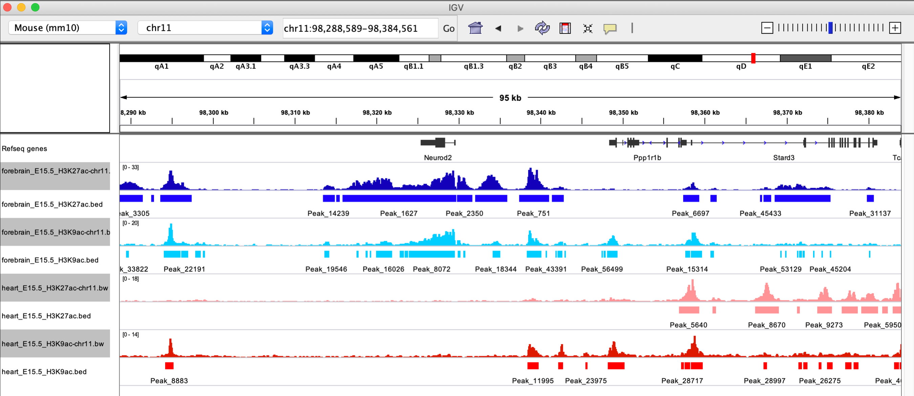

# Introduction to the Integrative Genomics Viewer (IGV)

## What is IGV?

The **Integrative Genomics Viewer (IGV)** is a very powerful piece of genomics software produced and distributed by researchers from the Broad Institute at MIT. IGV provides a fast and easy way to explore and visualize genomics data stored in various formats.

## Learning objectives:  
* Introduce IGV, its basic user interface, and basic data navigation
* Loading genomes and data into an IGV session
* Discuss and explore how IGV represents data stored across distinct file types
* Discuss exploratory analyses and visualizations that IGV is useful for
* Reading in custom genomes
* Saving and restoring an IGV session

---

## How do we use IGV?

IGV can be installed and run locally on MacOS, Linux and Windows as a Java desktop application (which is how we will use it today). You should have all downloaded and installed the Desktop version of IGV for the operating system you are working on.

An example of how a typical IGV session might look is included below. In this example, we have:
- Called peaks from multiple DNase-seq experiments (.BED)
- DNase-seq signal tracks representing chromatin accessibility (.BIGWIG)
- Representative alignments from one experiment (.BAM)

There is now also an [IGV web-app](https://igv.org/app/) that does not use Java and only needs an internet browser, although is generally going to be slower than if you run the Desktop version.

---

 In fact IGV allows us to bring in multiple file types simultaneously so that they can be evaluated together.

For example, it can be very useful to visualize variant calls alongside the alignment file used to generate them, in order to review evidence for specific variants.

Let's load in the VCF file (`Day-2/data/1000G.chr20.sub.vcf.gz`) for the same region on chr20, containing all the called variants across subjects in the 1000 Genomes project, and explore the called variants using the VCF and alignment files simultaneously.  

---
While a comprehensive overview variant review contrasting called variants against read alignments is beyond the scope of this workshop and more of an advanced topic, some aspects typically considered include:  
- Confriming all ALT reads are not strand-specific
- Mapping qualities and base qualities are consistent across reads representing the REF & ALT allele
- Variants are not called only at ends of reads
---

|:--:|
| **Figure 8 - Viewing VCF files in IGV** |

All variants are summarized at the top of the variant track, however since this VCF file also includes subject-specific genotypes, those are also represented here using the colors indicated in the figure below.

|:--:|
| **Figure 9 - Viewing individual-level variant calls in IGV** |

IGV allows you to customize how tracks are presented, and can be modified using `Preferences` found under the `View` tab. Tweaking preference can be useful in a number of ways:  
- Modifying the window size that IGV will start to load reads at
- Changing the types of reads that are masked from viewing (e.g. supplemental reads)
- Allowing *soft-clipped* bases to be shown

|:--:|
| **Figure 10 - Preferences for tyrack views in IGV** |

----
## Visualizing signal tracks and genomic regions with IGV

IGV also allows us to visualize a number of other genomic file types beyond BAM and VCF files. Very often in genomics experiments, we are interested in identifying regions of the genome that demonstrate increased signal compared to background. For example, DNA regions immunoprecipitated with a transcription-factor specific antibody in a ChIP-seq experiment.

In such experiments, we are usually interested in **which regions** show increased signal, which we call *peaks* and often store the genomic coordinates for these peaks in BED format.

We are also often in interested in *how much signal* these regions show in comparison to their surrounding regions, and commonly represent these data using the BigWig file format, often referred to as a *signal track*.

|:--:|
| **Figure 11 - ChIP signal, peak regions, and alignments for an example experiment** |

Lets read in some example ChIP-seq data (as shown in Figure 11) to demonstrate how you might go about exploring these types of data. We will use data from a recently published study of the dynamic regulatory landscape in the developing mouse ([Gorkin *et al*, 2020](https://www.nature.com/articles/s41586-020-2093-3?proof=t)).

In this study, the authors generate an atlas of the dynamic chromatin landscape at various time points during mouse embryonic development, conducting over 1100 ChIP-seq experiments and 132 ATAC-seq experiments spanning 72 stages of development across various tissues.

**Figure 1A-B from Gorkin *et al*, 2020, Nature**.

In particular, we will use the ChIP-seq data generated in immunoprecipitation experiments for several histone modifications, whose presence and absence can be used to infer the functional state of chromatin at specific loci (e.g. active transcription, enhancers, heterochromatin). These data have been downloaded and made available in this github repo, in: `Bioinformatics_workshop/Day-2/data/`.

Specifically, we will use ChIP-seq data for two histone modifications that are known to represent transcriptionally active chromatin regions:  
* H3K27ac - Acetylation of lysine 27 of histone 3
* H3K9ac - Acetylation of lysine 9 of histone 3

Since this experiment uses an alignment generated against mouse reference mm10, we need to switch the genome selected in IGV before we load in any data. Then, load in the following files:  
* `forebrain_E15.5_H3K27ac-chr11.bw` - ChIP signal
* `forebrain_E15.5_H3K27ac.bed` - Peak coordinates
* `forebrain_E15.5_H3K27ac-chr11.bam` - Read alignments

Peak regions for the BED file track clearly line up with the ChIP-signal track (.BigWig), and these regions also show high read densities, suggesting signal over the background level (as shown in *Figure 11*).

However, commonly in a ChIP-seq analysis, we are interested in comparing how TF binding sites or histone modifications change between samples. Let's load in some additional data so that we can compare chromatin states in the developing mouse forebrain to heart tissues. Start with the BED files:
* `forebrain_E15.5_H3K27ac.bed`
* `forebrain_E15.5_H3K9ac.bed`
* `heart_E15.5_H3K27ac.bed`
* `heart_E15.5_H3K9ac.bed`

Peaks called for each histone mark in either forebrain or heart tissue are now visible. Use the right click options to set the color of these tracks to aid in visualization. Can you see any regions where the chromatin marks differ between the groups?

|:--:|
| **Figure 12 - ChIP peaks for H3K27ac and H3K9ac in mouse E15.5 forebrain & heart tissues** |

Now use the search bar to navigate to the *Neurod2* gene. Clearly, the presence of peaks in forebrain tissues and the absence in heart suggests this region is only transcriptionally active in the developing forebrain.

However, without any information on the relative ChIP signal at these regions, we don't have any idea of  how transcriptionally active this region is compared to others. For this, we need to load in the signal track data in BigWig format. Load these in from the same directory now.

Bigwig files to load:
* `forebrain_E15.5_H3K27ac.bw`
* `forebrain_E15.5_H3K9ac.bw`
* `heart_E15.5_H3K27ac.bw`
* `heart_E15.5_H3K9ac.bw`

|:--:|
| **Figure 13 - ChIP peaks & signal for H3K27ac and H3K9ac in mouse E15.5 forebrain & heart tissues** |

Note the differences in the scales shown at the top left of each signal track. To fairly compare differences between samples, we need to use the same scale. Highlight the signal tracks and right click to select the `Autoscale` option.

Setting signal tracks to be on the same scale is very important when comparing between them. It is also important to know how the data have been normalized, since values that have been normalized in different ways aren't comparable on the same scale anyway (make sure you know what you are looking at).

|:--:|
| **Figure 14 - ChIP peaks **& signal** for region surrounding *Neurod2* ** |

IGV can also be used to compare multiple regions simultaneously using the split view functionality. There are a number of ways the split view can be activated, but perhaps the easiest is using the search bar.

Enter the following into the search bar to activate split view:
`Neurod2 Stat5b Top2a`

|:--:|
| **Figure 15 - ChIP peaks **& signal** for region surrounding *Neurod2* ** |

Split view has a number of useful applications, however it is especially useful when reviewing alignment evidence for complex structural variants or translocations (although we won't cover that today).

---

### Saving and restoring sessions in IGV

We did a lot of work loading in all these data and setting everything up just how we want it. It would be a shame to have to do this every time we want to revisit these data. Fortunately, IGV allows you to save sessions, allowing you to re-load everything just as you had it before.

Try saving the current session using `Save session...` under the `File` tab.

|:--:|
| ** Figure 16 - Saving sessions in IGV ** |

---

