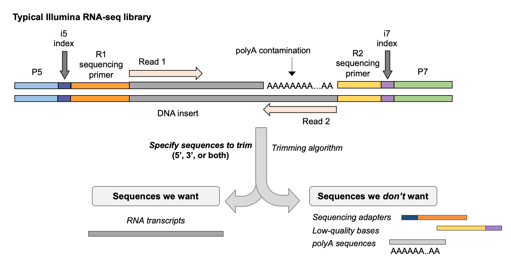

## Read pre-processing & trimming
------

An additional QC step one might perform on raw FASTQ data is to *pre-process* or *trim* the sequences to remove sequences that we are not interested in, or were not called confidently by the sequencer.

This step is **optional** in most analysis, although should be based on an empirical decision that leverages the QC assessment of raw FASTQs using a quality report like the one we just generated with FASTQC/MultiQC. For example, if we see we have a large number of adapter sequences in our data, or a high proportion of low-quality bases near our read ends, we may wish to trim our raw reads. Otherwise, we could skip this step in the analysis.

Notably, some read mappers account for mismatches or low quality bases at the end of reads in a process called *soft-clipping*, where these bases are masked from being included in the alignment, but are technically still part of the sequence read in the FASTQ. If you are using an aligner that performs soft-clipping, you could consider omitting read trimming of FASTQ files.

### Motivation for read trimming: Downstream steps are more efficient

Several algorithms exist for trimming reads in FASTQ format. Generally, these algorithms work by looking for matches to the sequence you specify at the 5' and 3' end of a read. You can specify the minimum number of bases you would like to be considered a match, as the algorithm will trim partial matches to the sequence you specify. Examples of sequences you might want to remove include:  
- adapter sequences  
- polyA tails   
- low quality bases  

<p align="center">

</p>

### Read trimming with cutadapt

[Cutadapt](https://cutadapt.readthedocs.io/en/stable/) is a useful tool for cleaning up sequencing reads, allows for multiple adapters to be specified simultaneously, and has an array of options that can be tweaked to control its behavior.

Basic usage of cutadapt:
```bash
cutadapt -a ADAPTER -g ADAPT2 [options] -o output.fastq input.fastq.gz
```
- `a` specifies an adapter to trim from the 3' end of read 1
- `g` specifies an adapter to trim from the 5' end of read 1
- `o` specifies name of out file

For paired-end reads:
```bash
cutadapt -a ADAPT1 -g ADAPT2 [options] -o out1.fastq.gz -p out2.fastq input1.fastq.gz input2.fastq.gz
```
Capital letters are used to specify adapters for read 2.

If we wanted to trim polyA sequences, as we often do in RNA-seq, and save the output to a report called cutadapt.logout, we could use:  
```bash
cutadapt -a 'A{76}' -o out.trimmed.fastq.gz input.fastq.gz > cutadapt.logout;
```
`-a A{76}` tells cutadapt to search for stretches of A bases at the end of reads, with a maximum length of the read length (76bp).

Since the polyA and adapter sequence contamination is relatively low for this dataset, we won't trim any specific sequences, although we will perform basic quality and length processing of the raw reads. Lets make a new directory and do this for do this for one sample.
```bash
mkdir -p $FOB/trim
cd $FOB/trim

cutadapt \
   -o SRR1039508_1.trim.chr20.fastq.gz \
   -p SRR1039508_2.trim.chr20.fastq.gz \
   $FOB/raw/SRR1039508_1.chr20.fastq.gz $FOB/raw/SRR1039508_2.chr20.fastq.gz \
   -m 1 -q 20 -j 4 > SRR1039508.cutadapt.report
```

- `-m` removes reads that are smaller than the minimum threshold
- `-q` quality threshold for trimming bases
- `-j` number of cores/threads to use

> :memo: **Note:** The trailing slashes ` \` at the end of each line in the `cutadapt` command enable us to separate each flag with newlines for easier human readability, these can be removed and instead the command could be written in one single line, however for detailed commands this can be unweildy. For example without the trailing slashes to separate each flag the command above would look like this: `cutadapt -o SRR1039508_1.trim.chr20.fastq.gz -p SRR1039508_2.trim.chr20.fastq.gz $FOB/raw/SRR1039508_1.chr20.fastq.gz $FOB/raw/SRR1039508_2.chr20.fastq.gz -m 1 -q 20 -j 4 > SRR1039508.cutadapt.report`


You should now have a trimmed FASTQ file in this directory that can be used for an alignment. Lets look at the report that cutadapt generated.
```bash
cat SRR1039508.cutadapt.report
```

Now lets run this on multiple samples:
```bash 
ls $FOB/raw/*.chr20.fastq.gz | while read x; do \

   # save the file name
   sample=`echo "$x"` 
   # get everything in file name after "/" and before "_" e.g. "SRR1039508"
   sample=`echo "$sample" | cut -d"/" -f3 | cut -d"_" -f1` 
   echo processing "$sample"

   # run cutadapt for each sample 
   cutadapt \
      -o ${sample}_1.trim.chr20.fastq.gz \
      -p ${sample}_2.trim.chr20.fastq.gz \
      $FOB/raw/${sample}_1.chr20.fastq.gz $FOB/raw/${sample}_2.chr20.fastq.gz \
      -m 1 -q 20 -j 4 > $sample.cutadapt.report
done
```

You should now have trimmed FASTQ files in this directory that we will use for the alignment. You should also be able to see and print each of your reports from cutadapt. 
```bash
ls *cutadapt.report | while read x; do
   echo -e "\n\n"
   echo Printing $x
   echo -e "\n"
   cat $x
done
```

**Additional note:** For data generated at Dartmouth, since much of the data in the Genomics core is generated using an *Illumina NextSeq 500*, we also often use the `--nextseq-trim` option in cutadapt.

This option works in a similar way to the quality threshold option `-q` BUT ignores Q-scores for stretches of G bases, as some Illumina instruments, such as the NextSeq, generate strings of Gs when the sequencer 'falls off' the end of a fragment and dark cycles occur, and therefore provides more appropriate quality trimming for data generated on these instruments.

