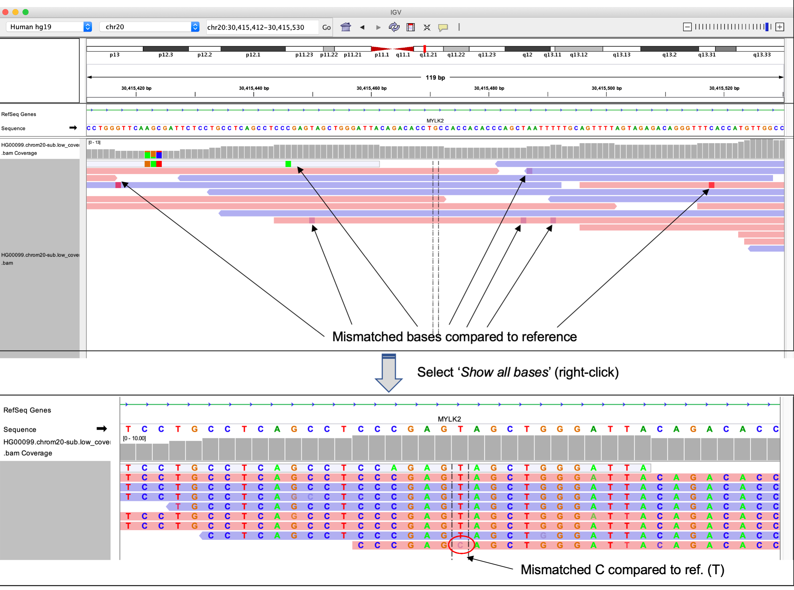

## Visualizing alignments with IGV
----

Alignments can be visualized using genome browser software such as the Integrative Genomics Viewer (IGV), allowing you to interactively explore alignments to a reference genome and how they overlap with genome annotation (e.g. gene models). This is an extremely useful way to visualize NGS data, and also allows you to review the evidence supporting downstream analysis results generated from aligned reads (e.g. variant calls).

The figure below shows some example alignments for paired-end mouse RNA-seq data visualized using the IGV.

Note how the alignments pile up over the exons, which makes sense since these are RNA-seq data where only the transcriptome was sequenced. In these data we expect to see gaps that span the intronic regions. If we had not used a gapped aligner such as STAR, we would have failed to generate many of these alignments. If these data were whole genome assembly we would expect more even coverage of most locations in the genome. 

IGV supports a wide-range of genomic file formats that contain data ranging from simple genomic regions, to complex alignments and signal tracks. File types supported by IGV include:  
* .BAM - alignments  
* .GTF/GFF - genomic features  
* .VCF - variant call format  
* .BED - genomic regions   
* .BIGWIG - signal tracks

We will cover the utilization of some of the other file types in another lesson, but the range of file formats supported by IGV means it is able to facilitate exploration and visualization of virtually all types of genomics data generated from diverse experimental procedures, for example:  

**Reference genomes and annotations**
The IGV server also hosts a number of reference genomes and annotations, meaning you do not need to load your own genome from a file for many model organisms. You can view the list of hosted genomes on their website [here](http://software.broadinstitute.org/software/igv/Genomes). IGV also provide access to data from large consortia-scale projects such as [*ENCODE*](https://www.encodeproject.org/), [*1000 Genomes*](https://www.internationalgenome.org/home), and [*The Cancer Genome Atlas (TCGA)*](https://www.cancer.gov/about-nci/organization/ccg/research/structural-genomics/tcga).

If your genome is not included in the available set through the IGV server, you can load genomes directly into IGV using `Genomes > Load Genome from file`. To visualize gene/transcript annotation for your genome, a GTF/GFF file containing gene, transcript, exon and UTR coordinates for that genome can be loaded using `File > Load From File.` IGV will automatically separate out the sequences in different entries of the FASTA file.

### How do we use IGV?

IGV can be installed and run locally on MacOS, Linux and Windows as a Java desktop application (which is how we will use it today). You should have all downloaded and installed the Desktop version of IGV for the operating system you are working on.

There is now also an [IGV web-app](https://igv.org/app/) that does not use Java and only needs an internet browser, although is generally slower than if you run the Desktop version.

**Note:** This is by no means a comprehensive guide to IGV. Far more functionality exists than we have discussed here, which can be explored in more detail on their website and using the [IGV User Guide](https://software.broadinstitute.org/software/igv/UserGuide).

### The IGV user interface (UI) and basic navigation

The layout of the IGV desktop application is relatively simple and easy to use after you familiarize yourself with the layout of the user interface.

Some of the main UI features include:
* **Currently loaded genome** - Shown in top left. Drop down menu allows you to toggle between pre-packaged genomes or access those available from the IGV server. Genomes can also be loaded using the `File` tab.

* **Current chromosome/contig** - Name of the chromosome, contig, or other sequence type currently being shown. Can be changed using drop down menu.  

* **Current region of chromosome/contig** - Coordinates in the form *chr:start-end* can be copied and pasted here directly to navigate to a region. Gene names can also be used (dependent upon the loaded annotation).

* **Zoom bar** - Zoom in and out of the currently shown region

* **Schematic of currently loaded chromosome or contig** - A red box indicates location of the region you are currently viewing. Full width of current region is shown below, with a scale bar indicating specific coordinates. Both can be used to navigate directly.

* **Gene track** - Shows gene included in currently loaded annotation (Refseq genes in example). Right click track for additional formatting options. Features included in annotation are indicated by thickness (introns, exons, UTRs). Gene orientation is shown with arrows pointing right for FWD/+, left for REV/- strand.

IGV allows you to customize how tracks are presented, and can be modified using `Preferences` found under the `View`tab. Tweaking preference can be useful in a number of ways:

Modifying the window size that IGV will start to load reads at
Changing the types of reads that are masked from viewing (e.g. supplemental reads)
Allowing soft-clipped bases to be shown

### Working with BAM files (alignments) in IGV

BAM files can be loaded using the `File` tab and selecting `Load from file`. We will use an example BAM file that contains a small number of alignments on chromosome 20 (to reduce file size) of *hg19*, generated from low pass whole-genome sequencing of an individual in the [*1000 Genomes Project*](https://www.internationalgenome.org/home)

Load this file in now (located in your github repo directory `Day-2/data/HG00099.chrom20-sub.low_coverage.bam`.)

**Important note:** The **index file** (ending in .bai) needs to be in the same directory as the BAM file for IGV to load it. BAM files are typically very big and the index creates an efficient index, like you would find in the back of a book, that helps us navigate through the file quickly. We created an index file earlier in the lesson with the `samtools index` command.

You can see a large number of reads shown in red and blue. Reads aligning to the FWD strand of the reference are shown in red. Reads aligning to the reverse strand are shown in blue.

A read coverage bar is automatically show above the alignments. The coverage track is a histogram that shows the number of reads covering each base in the visible region.

Zoom in closer to view the *MYLK2* gene.

Now we have zoomed in closer, we can see more detail about the reads (e.g. direction indicated by their arrowhead) and the gene features they cover. Since this is WGS data, it makes sense for alignments to cover exons, introns, UTRs, and intergenic regions. Remember the distribution of the data is determined by the experiment.

To gain more information on specific reads, hover over a single read. Some of this information may look familiar based on our discussions of the BAM file format.

You can also see some features on specific reads are highlighted. IGV uses colors within reads to highlight features of individual bases. For example, IGV will highlight bases that are mismatched compared the reference. Such bases could represent genetic variants.

If you right click in the alignment track, you will see a number of options appear for changing how the alignments are displayed. One useful option is `View reads as pairs`. Provided your data are paired-end, R1 and R2 reads will be connected by a thin gray line, representing a region that exists in the genome, but was not captured by either end of the paired end sequencing, either because the fragment length was larger than the read lengths or because the read spans and intron or long deletion.

Another useful alignment viewing option available from this menu is changing how reads are colored. By default, read are colored according to the strand they are aligned to, which is useful in several contexts, for example, when working with stranded RNA-seq data, however other coloring schemes can be selected, e.g.
- by read group
- by library

Insertions and deletions are also highlighted using a purple I (for insertions) or a horizontal black line (for deletions).

You can start to appreciate how IGV helps identify features of our data, e.g. potential variants. This information could help to inform subsequent analyses. 

> **Note:** This lesson is only designed to serve as an introduction to IGV. The complete functionality is described on in the [IGV User Guide](https://software.broadinstitute.org/software/igv/UserGuide). I encourage you to visit and explore the user guide after completing this tutorial.

If you use IGV in your publications, you should at cite at least the original publication [(found here)](https://www.nature.com/articles/nbt.1754).

Other genome browsers do exist and have various strengths/weaknesses. For example, the [*UCSC Genome Broswer*](https://genome.ucsc.edu/), is an excellent web-based tool that allows you to perform many of the same visualizations that you would using IGV using your own data, and also provides access to a large collection of hosted datasets. The major advantage of IGV is the ease and speed with which it allows you to explore your own data, which can be slower to explore using a web-based tool.

## Break out room exercises
-----
- Look at one of your alignments in the IGV, make sure to load the correct version of the genome for this annotation (hg38). Remember these data only have reads mapped to chromosome 20.

- What happens if you load the older version of the human genome (hg19)? Does the distribution of the data make sense? Why?

