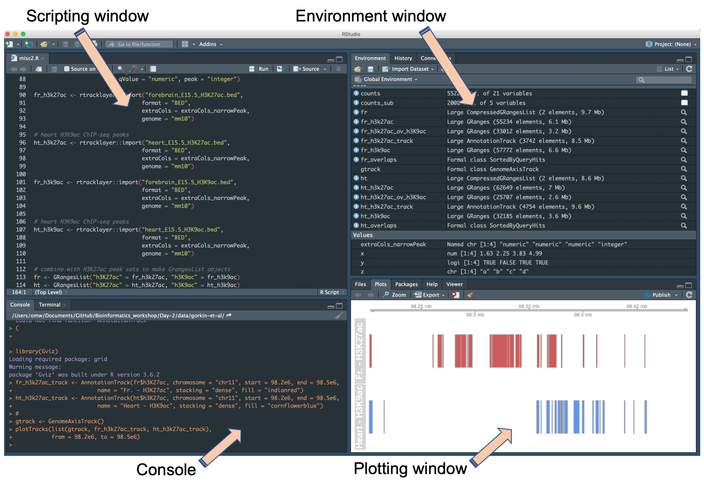

# Introduction to R

------------------------------

### Learning objectives:
- Learn the basic syntax and data types available in R.
- Learn about the RStudio environment.
- Learn to read and write files within R.

------------------------------

R is a free, open source programming language and statistical software environment, first released in 1993, that is used extensively in bioinformatics. Beyond the basic functionality included in R's standard distribution, an enormous number of packages designed to extend R's functionality for specific applications exist, representing one of R's core strengths.

R is also a very powerful way to create high quality graphics, using both functionality in base R as well as graphics specific packages, such as [ggplot2](https://ggplot2.tidyverse.org/). These packages provide a high level of user control, meaning almost all plotting features can be controlled. Importantly, numerous R packages provide functionality for generating bioinformatics specific visualizations.

Visit the *R-Project* homepage [here](https://www.r-project.org/).


> **Note:** This is not a comprehensive introduction to R-programming, but rather a review of the basics to help get you started. In addition to the materials provided to you before the workshop, there are some links to more comprehensive tutorials for R in the 'cheat-sheets.md' in the parent directory of the workshop repository.

R is generally considered a *functional programming language*. Without going into detail, this essentially means that the way in which R performs tasks and solves problems is centered around **functions**.

**Functions** are specific pieces of code that take a defined input, perform an operation or series of operations on the input, and return an output, again in a defined format.

In R, the basic syntax of a function is as follows:
`name_of_function(argument1 = value, argument2 = value, ...)`

For example, the `print()` function will print the argument(s) provided to it as input to the R console as outputs. In the below code chunk, the input "Hello" is being provided to the `print()` function as input to its first argument.

```r
print("Hello")
```

Manual/help pages for a specific function can be obtained using `?`. To bring up the manual page for the `print()` function:
```r
?print()
```

## How do we use R?

There are several ways we can interface with R, including:

- the basic user interface
- running directly from a terminal-type application
- using a graphical user interface (GUI) or Integrated Development Environment (IDE)

While there are times when it is preferable to run R in one way over another, using a GUI or IDE is perhaps the most popular way to interface with R, with the most popular IDE being *RStudio*.

### RStudio

[RStudio](https://rstudio.com/) is an IDE (Integrated Development Environment). An IDE is software built to consolidate different aspects of writing, executing, and evaluating computer code. Without an IDE, these aspects of programming would need to be performed in different applications, potentially reducing productivity.  


**Basic features of the RStudio IDE include:**  
- console for submitting code to
- syntax-highlighting editor used for writing R-scripts
- windows for environment management, data visualization, and debugging
- facilities for version control & project management




When using RStudio, you will generally want to generate your code using the scripting window first, and then use the options available to submit this code, or segments of it, directly to the console using the buttons at the top of the scripting window (or keyboard shortcuts!).

We will be using RStudio throughout the workshop, although will point out how and when you may wish to run R interactively (such as on an HPC).

---
## Orienting yourself

As with working on the terminal, a good first step is to orient yourself. Let's see where you are on your local computer and reset this location to where you want to be with the `getwd()` and `setwd()` functions.

```r
# Where are you on your local machine
getwd()

# Set working directory to the data folder in the github repository you downloaded - notice that the path needs to be in double quotes
setwd("your_path/RNA-seq-Differential-Expression-workshop-June-2022-master/data")
```

## Basic data structures in R

Programming in R is achieved by assigning values to *objects*. Objects are specific data structures that take on a particular form defined by that object's *class*. The most fundamental and basic object class in R are *vectors*.

### Vectors

Vectors can only hold one type of data (a property referred to as being *atomic*). In R, five basic object classes exist:  
- numeric - real numbers (e.g. 33.3334)
- integer - whole numbers (e.g. 42)
- character - strings of characters (e.g. letters, words, sentences)
- logical - `TRUE` or `FALSE` (commonly called 'Boolean' values elsewhere)
- complex - numbers with real and imaginary parts.

Vectors can be created using the `c()` function (standing for *combine*), which concatenates its arguments together into a single vector. c() can be used in conjunction with the assignment operator `<-` which tells R you want to assign that vector to a specific variable.
```r
# numeric
x <- c(1.63, 2.25, 3.83, 4.99)

# integer
x <- as.integer(c(1, 2, 3, 4))

# character
x <- as.character(c("a", "b", "c", "d"))

# logical
x <- c(TRUE, FALSE, TRUE, TRUE)

# mixed?
x <- c(1, "a")
```

Each object class has specific *attributes*, which we can extract using the appropriate accessor functions. For example, the class of an object is itself an attribute that can be obtained using the `class()` function:
```r
class(x)
```

Another important attribute is length. For example, if we want to know how many elements are in a character string, we can use the `length()` function.
```r
length(x)
```

Vectors can be combined or nested to create a single vector, or evaluated against each other:
```r
# combine a vector and a nested vector
x <- c(1, 2, 3, 4, c(1, 2, 3, 4))
x

# multiply two integer vectors
y <- c(2, 2, 2, 2)
x * y
```

Even though vectors are atomic, they can be coerced from one class to another using functions written to modify their attributes. e.g.
```r
x <- c(1, 2, 3, 4)
as.character(x)

x <- c(TRUE, FALSE, TRUE, TRUE)
as.numeric(x)

x <- c(1.63, 2.25, 3.83, 4.99)
as.integer(x)
```

Elements within vectors can be subset or indexed based on their position in that vector. Individual elements can also be assigned names, which can also be used to perform indexing.
```r
# define a character vector
x <- c("a", "b", "c", "d")

# get elements 1 and 3
x[c(1,3)]

# get elements 1 to 3 using the ':' operator
x[c(1:3)]

# define a numeric vector
x <- c(1.63, 2.25, 3.83, 4.99)

# assign it names
names(x) <- c("gene 1", "gene 2", "gene 3", "gene 4")

# index for specific element
x["gene 1"]
```

Vectors can contain missing values, defined by `NA` and `NaN`. These elements can be identified with the functions `is.na()` or `is.nan()`:
```r
x <- c(1.63, NA, 3.83, 4.99)
x

x.na <- is.na(x)
x.na

# what object class is returned  
class(x.na)
```

### Operators

We introduced two *operators* in the examples above, the assignment operator `<-` and the sequence operator `:`. Operators are essentially symbols that tell R how you would like to relate the *operands* on either side of the symbol. In R, operators can be broadly categorized into *assignment*, *arithmetic*, *relational*, and *logical*.

The assignment operators are `<-` and `=` which both tell R to assign a vector to a some value. It is best to stick to one within a single project.

Below are the basic *arithmetic*, *relational*, and *logical* operators that are useful to know.

**Arithmetic operators**

Operator | Effect
----- | -----
\+ | addition
\-	| subtraction
\*	| multiplication
/	| division
^ |	exponentiation

Some example usage of arithmetic operators:
```r
# addition
1 + 2

# multiplication
2 * 3

# exponentiation
2^4
```

**Relational operators**

Operator | Effect
----- | -----
<	| less than
\>	| greater than
<= |	less than or equal to
\>=	| greater than or equal to
== |	equal to
!= |	Not equal to

Some example usage of relational operators:
```r
x <- c(1, 2, 3, 4)

# which elements are less than 3
x < 3

# which elements are less than or equal to 3
x <= 3

# define a character string
x <- c("a", "b", "c", "d", "a")

# which elements are equal to a
x == "a"
```

**Logical operators**

Operator | Effect
----- | -----
!	| NOT
&	| AND
\|	| OR

Some example usage of logical operators:
```r
x <- c(1, 2, 3, 4)

# which elements are NOT equal to 4
x != 4

# which could also be achieved with
!x == 4

# which elements are less than 2 or equal to 4
x < 2 | x ==4

# which elements are less than 2 AND equal to 4
x < 2 & x == 4
```
**Note:** When combining operators, operator precedence applies, such that operators with high precedence will be evaluated first. For example, in the above line, `x < 2` will be evaluated before `x == 4` as the `<` has greater precedence than `==`. You can explore operator precedence in R using the man page returned by `?Syntax`.

Relational and logical operators can be used to subset a vector based on the values returned by the operator, and the brackets, as we did above for specific elements.
```r
x <- c(1, 2, 3, 4)

# subset x for values less than 3
x_sub <- x[x < 3]
x_sub

# define a character string
x <- c("a", "b", "c", "d", "a")

# subset x for elements equal to a
x[x == "a"]
```


### Factors

Factors are a special instance of vectors where only predefined values, called *levels* can be included in the vector. Such vectors are useful when you know that elements of a vector should take on one of those predefined values.

Categorical data is often stored in vectors, making them a very important object class when you start doing any statistical modeling in R. For example, you might store subject sex for all the subjects in your study as a factor, with the levels *male* and *female*.

```r
# make a character vector with only male or female as entries
x <- c("female", "female", "male", "female", "male")

# use factor() constructor function to generate the factor
x <- factor(x, levels = c("female", "male"))

# confirm the class and check the levels
class(x)
levels(x)

# use table() to count up all the instances of each level
table(x)
```

### Lists

Sometimes, it may be desirable to store multiple vectors, or even vectors of different object classes, in the same R overall object. Lists are a special object class that permits objects with these attributes, making them distinct from atomic vectors.

In the same way that vectors and factors are constructed using `c()` and `factors()` respectively, lists are created using the `list()` constructor function.

```r
x <- list(c(1.63, 2.25, 3.83, 4.99),
          c(2.43, 8.31, 3.12, 7.25),
          c(1.29, 3.23, 3.48, 0.23))

# the structure function str() can be useful to examine the composition of a list
str(x)

# confirm the length
length(x)

# lists can be subset using brackets
### subset for first element of list
x[[1]]
### subset for first element of first vector in list
x[[1]][1]

# lists elements can be given names using a character vector equal to list length
names(x) <- c("gene_1", "gene_2", "gene_3")

# names can also be used to subset a list
x[["gene_1"]]

# subsetting can also be achieved with the $ subsetting operator
x$gene_1
```

In our example list, all three vectors stored in the list are numeric, however as mentioned above, lists can store vectors of different classes.


```r
x <- list(c(1.63, 2.25, 3.83, 4.99),
          c(TRUE, FALSE, TRUE, TRUE),
          c("a", "b", "c", "d"))

# use the structure function str()to examine the composition of the list
str(x)
```

### Creating a Count Matrix

Once sequencing is completed on your experiment you will be provided a count matrix with sample names across the top of your text file and gene names down the left hand side. This file is used for downstream processing. Today, we will be creating a count matrix of our own to familiarize ourselves with vectors and data frames. We will begin by generating a matrix with 10 columns and 10 rows of random numbers between 0 and 10.

First we create a vector of numbers from 0 to 10:

```r
num.vector <- c(0:10)
```

We have our computer randomly select 100 numbers from our num.vector and put it in a vector of size 100. You might notice the argument replace=TRUE. This tell the computer to sample from our num.vector with replacement, meaning each number can be chosen to be put in the count.vector more than once.

```r
count.vector <- sample(num.vector, size = 100, replace = TRUE)
count.vector
```

We now create a matrix using our count.vector. We tell R that we want a matrix with 10 rows and 10 columns with the data in count.vector. byrow means that we are arranging the data row-wise instead of column-wise, which is the default in R.

```r
count.matrix <- matrix(count.vector, ncol=10, nrow=10, byrow = TRUE)
count.matrix
```
Now that we have created a matrix of random whole numbers for our count matrix, we need to add sample names and genes. I mentioned previously that our sample names will be the column headers and the row names will be the gene names. Hence, we will be needing 10 sample names and 10 gene names for our dataset.

```r
rownames(count.matrix) <- c("gene_1", "gene_2", "gene_3","gene_4","gene_5","gene_6","gene_7","gene_8","gene_9","gene_10")
colnames(count.matrix) <- c("subject_1", "subject_2", "subject_3", "subject_4","subject_5","subject_6","subject_7","subject_8","subject_9","subject_10")
count.matrix
```

Challenge: We can use a coding shortcut here! It's easy to make typos while writing out all the gene and sample names. Let's use the paste function to make things easier for us. Here we are telling R to make the first part of our name 'gene' and 'sample' respectively. Then, we are telling R to add the numbers 1 through 10 to the end of each sample or gene name.

```r
rownames(count.matrix) <- paste('gene',1:10,sep='_')
colnames(count.matrix) <- paste('subject',1:10,sep='_')
count.matrix
```

You can access data in the matrix using the commands below.

```r
# check the structure and dimensions with dim()
str(count.matrix)
dim(count.matrix)

# specific elements can be obtained through subsetting
### row 1
count.matrix[1,]
### column 2
count.matrix[,2]
### element 2 of row 3
count.matrix[3,2]

# check class of the object and one row
class(count.matrix)
class(count.matrix[1,])
```
Matrices are a very important object class for mathematical and statistical applications in R, so it is certainly worth exploring more complex matrix operations if you will be doing any more complex statistical analysis in R.

### Data frames

Data frames are very efficient ways of storing tabular data in R. Like matrices, data frames have dimensionality and are organized into rows and columns, however data frames can store vectors of different object classes. Let's convert our matrix to a data frame in R.

```r
count.df <- as.data.frame(count.matrix)
count.df
```
We can also directly create data frames in R. This is useful if we need to add information about our subjects like sex, race, age range, smoking status, etc. Let's create one of these data frames for our subjects here.

```r
df <- data.frame(subject_id = c("subject_1", "subject_2", "subject_3", "subject_4","subject_5","subject_6","subject_7","subject_8","subject_9","subject_10"),
                 age = c(45, 83, 38, 23, 65, 40, 32, 89, 77, 53),
                 gender = c("female", "female", "male", "female", "female", "male", "female","male","male","male"),
                 status = c("case", "case", "control", "control","case","case","case","control","control","case"))

str(df)
```
Note that the default behavior of data.frame() in R version < 4.0 is to convert character strings to factors. If you want to prevent this behavior, you can set the StringsAsFactors argument as FALSE. In R versions > 4.0, the default behavior is StringsAsFactors==TRUE.

```r
df <- data.frame(subject_id = c("subject_1", "subject_2", "subject_3", "subject_4","subject_5","subject_6","subject_7","subject_8","subject_9","subject_10"),
                 age = c(45, 83, 38, 23, 65, 40, 32, 89, 77, 53),
                 gender = c("female", "female", "male", "female", "female", "male", "female","male","male","male"),
                 status = c("case", "case", "control", "control","case","case","case","control","control","case"),
                 stringsAsFactors=FALSE)

str(df)
```
Data frames can be subset in similar ways to matrices using brackets or the $ subsetting operator. Columns/variables can also be added using the $ operator.

```r
# get first row
df[1,]

# get first column
df[,1]

# get gender variable/column
df[, c("gender")]

# # get gender and status
df[, c("gender", "status")]

# get the gender variable with $
df$gender

# add a column for smoking status
df$smoking_status <- c("former", "none", "heavy", "none","none","heavy","heavy","heavy","former","former")
```

Relational (e.g. ==) and logical operators (e.g. !) can be used to interrogate specific variables in a data frame. The resulting logical can also be used to subset the data frame.

```r
# obtain a logical indicating which subjects are female
df$gender == "female"

# use logical to subset the data frame for only female subjects (rows)
df2 <- df[df$gender == "female", ]

# check dimensions of the new data frame
dim(df2)

# use the LOGICAL NOT operator ! to obtain only male subjects  
df[!df$gender == "female", ]

# this could obviously also be achieved with..
df[df$gender == "male", ]
```

### Beyond the basic object classes

As we discussed, one of the major advantages of R is its enormous user base that are continuously developing and releasing packages. Implementing the additional functionality of these packages often requires **more complex data object classes to be created**, which are generally related in some way to one or more of the basic data structures in R that we have discussed.

The general approach used to create these novel classes is referred to as *object-orientated programming (OOP)*. Although we will not go into any detail on OOP in this workshop, it is useful to know that several OOP methods are used to create classes in R.

The [S4 OOP approach](http://adv-r.had.co.nz/S4.html) is perhaps the most relevant to this workshop, as it is heavily used by packages from the [Bioconductor project](http://bioconductor.org/), which we will be using on Day 3. S4 OOP provides a flexible approach to creating objects with multiple *slots*, each with defined names and object classes.

An example of a package that has used an S4 OOP approach to create objects of novel classes is the Bioconductor package [*GenomicRanges*](https://bioconductor.org/packages/release/bioc/html/GenomicRanges.html), which provides representation and query of genomic region data in R through object classes such as `GRanges`.

To efficiently represent genomic regions data, `GRanges` class objects, at least 3 key slots (each with their own associated class for that vector) will be needed:
- a chromosome slot: with class `character` (e.g. chr1)
- a start coordinate slot: with class `integer` (e.g. 338833)
- an end coordinate slot: with class `integer` (e.g. 338987)

Creating object classes in this way is desirable as it allows *accessor functions* to be created, which allow very simple interaction with the objects of this class. For example, simply using the `chr()` accessor function to easily extract all chromosome identities of the genomic regions in my GRanges object.

An excellent tutorial describing S4 classes and their use in the [Bioconductor project](http://bioconductor.org/) is available [here](https://bioconductor.org/help/course-materials/2017/Zurich/S4-classes-and-methods.html). While this is not a topic you need understand in great detail, it is worth understanding the basic principles.


## Functions

Beyond the functions implemented in base R and packages that you install, R allows you to create user defined functions, which can perform any functionality that you can define.

Defining your own functions can be useful when you want to perform a specific set of tasks repeatedly on some input(s) and return a defined output. Furthermore, once defined functions become part of your global environment and are therefore preserved for future use they minimize the need for repetitive code.

Functions are created using `function()` with the assignment operator `<-`. The arguments you use in the `function()` command define the variables that those arguments will be assigned to when you call the function. The last line of the function defines what output is returned.

Let's define a basic function as an example.
```r
# define the function that takes a single argument and returns a single argument
myfun <- function(x){
  y <- x + 1
  return(y)
}

# call the function
myfun(x = 10)

# assign the output to a new variable
var1 <- myfun(x = 10)
var1
```

Functions can have as many arguments as you specify. The names of these arguments are only assigned as variables within the function, however it is good practice to avoid using arguments with the same name as variables already existing in your global environment.

For example, if I already have a variable named `x` in my environment, I should avoid using x to define the name of the arguments to my function.
```r
myfun2 <- function(num1, num2){
  num3 <- num1 + num2
  return(num3)
}

# call the function
myfun2(num1 = 10, num2 = 11)
```

## Loops

Loops are used to iterate over a piece of code multiple times, and can therefore be used to achieve specific tasks. The most often used type of loop in R is the `for()` loop, which will evaluate the contents of the loop for all of the values provided to the `for()` function.

For example:
```r
x <- c(1,2,3,4,5,6,7,8,9)

# define the loop, using [i] to define the elements of x used in each iteration
for(i in 1:length(x)){
  print(x[i] * 10)
}
```

We may wish to save the output of each iteration of the loop to a new variable, which can be achieved using the following approach:
```r
x <- c(1,2,3,4,5,6,7,8,9)

# create variable to save results to
y <- c()

# define and run the loop
for(i in 1:length(x)){
  y[i] <- x[i] * 10
}

# print the new vector to console
y
```

## Basic data visualization

R is a very powerful tool for visualization and provides a large amount of user control over the plotting attributes. Basic visualization in R is achieved using the `plot()` function.

```r
# generate a set of random numbers to plot
x <- rnorm(1000, mean = 10, sd = 2)
y <- rnorm(1000, mean = 20, sd = 1)

# plot x against y to produce a scatter plot
plot(x, y)

# add labels, title, and color
plot(x, y,
     main = "X vs. Y",
     xlab = "X values",
     ylab = "Y values",
     col = "red")
```

R can also be easily used to generate histograms:
```r
# generate a simple histogram for x
hist(x, col = "indianred")

# the breaks argument can be used to change how the intervals are broken up
hist(x, col = "indianred", breaks=10)
hist(x, col = "indianred", breaks=50)
hist(x, col = "indianred", breaks=100)
```

> This is an *extremely* brief introduction to data visualization in R, however there are many excellent online resources for learning more about how to perform effective data visualization in R.

### Visualization specific packages

There are a large number of packages designed specifically for visualization and are very useful in bioinformatic analyses. We won't cover these here since they are covered extensively elsewhere, but some useful visualization packages to be aware of include:
- [ggplot2](https://ggplot2.tidyverse.org/reference/ggplot.html)
- [ggpubr](http://www.sthda.com/english/articles/24-ggpubr-publication-ready-plots/)
- [ploty](https://plotly.com/python/)

Importantly, visualization implemented in these packages form the basis for some bioinformatics specific data visualization packages that we will explore later in the workshop.


### Exporting Tabular Data

We may want to save our count matrix and metadata from the Matrices section to files we can later read back into R.

The major functions in base R that exist for writing tabular data to file are write.table() and write.csv(). Similarly to the read functions, write.table() provides a more generalized solution to writing data that requires you to specify the separator value.

In both functions, the first argument specifies the object in your global environment that you wish to write to file. The second argument defines the absolute or relative path to the location you wish to save this file.

```r
setwd("your_path/RNA-seq-Differential-Expression-workshop-June-2022-master/data")
# write to tab delimited file using write.table
write.table(count.df, file = "count_df.txt", sep = "\t")
```

In contrast, read.csv() does not require you to set the delimitor value, and by default writes data to comma separated value files (.csv).

```{r}
setwd("your_path/RNA-seq-Differential-Expression-workshop-June-2022-master/data")
write.csv(df, file = "metadata_df.csv")
```

### Importing Tabular Data

Tabular data are often stored as text files where the individual fields containing data points are separated by punctuation points. Three functions exist in base R to facilitate reading in tabular data stored as text files.

read.table() - general function for reading in tabular data with various delimiters
read.csv() - used to read in comma separated values files, where commas are the delimiter
read.delim() - used to read in files in which the delimiters are tabs

Use read.table() to read in the count_df.txt. Since read.table() is a general function for loading in tabular data, we need to specify the correct separator/delimiter value using the sep argument. Tab delimited data is specified using \t in the sep argument.

```r
setwd("your_path/RNA-seq-Differential-Expression-workshop-June-2022-master/data")
# check where we are
getwd()

# using read.table
count.df <- read.table(file = "count_df.txt",
                     sep = "\t", header = TRUE, stringsAsFactors = FALSE)

### Note 1: header accepts logical value indicating if the first row are column names (default FALSE)
### Note 2: we use stringsAsFactors

# check class, dimensions and structure
class(count.df); dim(count.df); str(count.df)
```
Now use read.delim(). An important difference between read.delim() and read.table() are the default setting for the sep and header arguments. By default in read.delim(), sep is set to \t and the header argument is set to TRUE, so we do not need to explicitly call those arguments.

```r
setwd("your_path/RNA-seq-Differential-Expression-workshop-June-2022-master/data")
# using read.delim
count.df <- read.delim(file = "count_df.txt", stringsAsFactors=FALSE)

# check class, dimensions and structure
class(count.df); dim(count.df); str(count.df)

```
read.csv() is used in exactly the same way read.delim(), however the file specified must contain data separated by commas and have the extension .csv.
```r
setwd("your_path/RNA-seq-Differential-Expression-workshop-June-2022-master/data")
meta_data <- read.csv(file = "metadata_df.csv",row.names=1)
meta_data
```
Let's read in some publicly available data from a real RNA-seq run. The paper and access to the data can be found at this [link](https://0-www-ncbi-nlm-nih-gov.brum.beds.ac.uk/geo/query/acc.cgi?acc=GSE198520). This data was generated from synovial fluid collected from inflamed joints of patients with rheumatoid arthritis before and after treatment with a TNF-a blocker, a common treatment for this disease.

```r
setwd("your_path/RNA-seq-Differential-Expression-workshop-June-2022-master/data")
example.df <- read.table(file = "GSE198520_Raw_gene_count_matrix.txt",
                     sep = "\t", header = TRUE, stringsAsFactors = FALSE)
head(example.df)
```

When datasets get very large, these base R functions can be quite slow. Although we do not have time to cover them here, the readr and data.table packages contain functions that introduce extremely fast ways of reading data into an R environment.


## Save R objects to file

It is possible to save R objects to a file that maintains all of their attributes so that they can be easily loaded back into a new R session. This functionality is achieved using the `save()` and `load()` functions.

`save()` accepts the names of the R objects you wish to write to a file (which will have the extension `.rdata`) as the first arguments, and the file path where you wish to write this file under the *file* argument. For example:
```r
# create some R objects
x <- c(1.63, 2.25, 3.83, 4.99)
y <- c(TRUE, FALSE, TRUE, TRUE)
z <- c("a", "b", "c", "d")

# check where we are
getwd()

# save all 3 objects to one file
save(x, y, z, file = "my_r_objects.rdata")
```

These objects can then be loaded back into your global environment using the `load()` function with the absolute or relative file path. The objects will appear in your new environment with exactly the same names as in your previous environment.
```r
load(file = "my_r_objects.rdata")
```

Single R objects can be saved and restored in a similar way using the `saveRDS()` and `readRDS()` functions. Files saved using RDS must take on the `.rds` extension.
```r
# save a single object to a specific file path
saveRDS(x, file = "my_r_object.rds")

# use the assignment operator to assign object to any variable you want
x <- readRDS(file = "my_r_object.rds")

# I changed my mind, I want the object to be assigned to variable `a` in my new env
a <- readRDS(file = "my_r_object.rds")
```
